# A Missingness-Aware Self-Supervised Teacher-Student Framework for Limited-Input ABPM Risk Estimation

Short title: **ABPM-TSL: ABPM Teacher-Student Learning**

## Key Points: Why This Approach Is Important

- Full 24-hour ABPM captures night-time BP, dipping, morning rise, BP load, and variability, but it is not always available at the point of care.
- Clinic BP alone can miss masked hypertension and can overstate risk in white-coat patterns.
- A teacher-student framework lets full ABPM act as privileged information during model development while the deployed student uses only simple clinic, home, demographic, and lifestyle inputs.
- Missingness-aware learning is important because real clinical forms are often incomplete.
- The model should support ABPM prioritisation, not replace ABPM diagnosis.
- Synthetic limited-input data are useful for method development, but clinical claims require validation in a real paired clinic/home BP plus ABPM cohort.

## Abstract

This study proposes ABPM-TSL, a missingness-aware self-supervised teacher-student framework for estimating ABPM-defined risk patterns from limited clinical inputs. During training, full 24-hour ABPM recordings are used as privileged teacher data to learn sleep-aware blood pressure representations. The teacher is pretrained with masked reconstruction and then fine-tuned to predict rule-derived ABPM phenotypes such as abnormal dipping, morning surge, nocturnal hypertension, high BP burden, and high variability. A limited-input student model uses clinic BP, simulated or real home BP, demographics, history, lifestyle fields, and missingness masks to approximate the teacher outputs and representation. At inference, only the student model is used. This repository implements a transparent prototype estimator in the desktop app and documents a full research plan for later neural teacher-student training. Current results are proof-of-concept only and must not be interpreted as clinical validation.

## Background

Ambulatory blood pressure monitoring provides information that clinic BP cannot fully capture: sleep BP, nocturnal hypertension, dipping category, morning surge, BP burden, pulse pressure, and variability. The current repository already computes sleep-aware ABPM summaries and rule-derived labels from patient readings. The proposed method extends that foundation into a learning framework where ABPM is used during development but not required by the deployed limited-input student.

This design follows the idea of learning with privileged information: extra information is available during training but not at test time. Vapnik and Vashist described this learning paradigm in which a teacher can provide hidden or privileged information to improve learning. Knowledge distillation is also relevant because the limited student learns from richer teacher outputs rather than only hard binary labels.

## Research Question

Can a model trained with full ABPM as privileged information estimate ABPM-defined risk patterns when only limited clinic, home, demographic, and lifestyle inputs are available?

The intended deployment claim is narrow:

> The student can support ABPM prioritisation when full monitoring is unavailable.

The study must not claim:

> The student can diagnose hypertension without ABPM.

## Figure 1. Proposed Framework

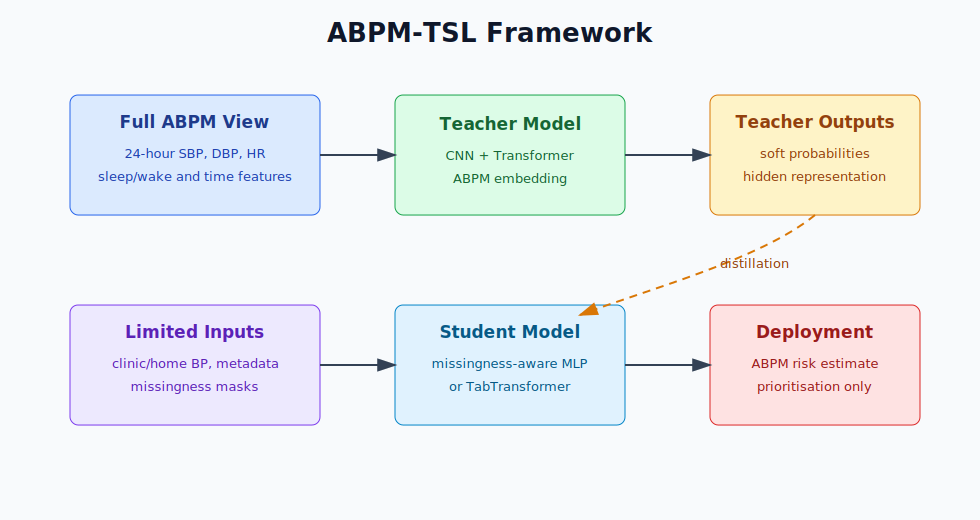

## Data Design

Each patient has two views.

| View | Used During Training | Used During Inference | Main Content |
| --- | --- | --- | --- |
| Privileged full ABPM view | Yes | No | 24-hour SBP, DBP, HR, sleep/wake state, time features, ABPM-derived labels |
| Limited-input view | Yes | Yes | Clinic BP, home BP, demographics, history, lifestyle, missingness masks |

### Privileged Full ABPM View

The teacher sees:

- SBP sequence
- DBP sequence
- HR sequence where available
- sleep/wake state
- time of day encoded as sine/cosine
- missingness mask
- rule-derived ABPM labels

### Limited-Input Student View

The student sees:

- clinic SBP and DBP
- morning home SBP and DBP
- evening home SBP and DBP
- 3-day and 7-day home averages
- age, sex, BMI, resting pulse
- diabetes, smoking, previous hypertension, medication status
- sleep duration, sleep quality, caffeine, alcohol, stress
- a missingness flag for every input feature

## Synthetic Limited-Input Generation

The synthetic limited-input cohort should be derived from real ABPM, not invented independently.

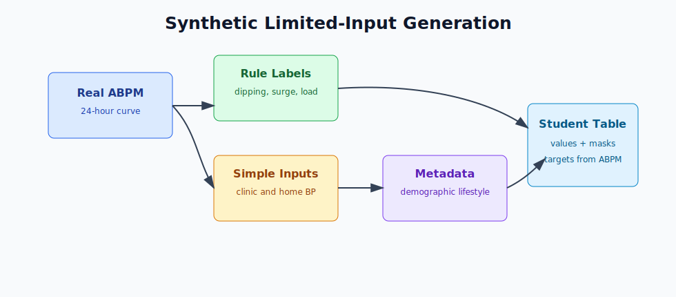

Recommended simulation rules:

- Clinic BP is generated from awake mean ABPM plus measurement noise.
- White-coat-like examples have clinic BP above awake ABPM.
- Masked-like examples have clinic BP below ABPM burden.
- Morning home BP is sampled from the first 2 hours after waking.
- Evening home BP is sampled from late awake readings.
- 3-day and 7-day home BP values are generated from repeated morning/evening measurements with noise.
- Demographic and lifestyle fields should use real metadata when available; otherwise they should be generated with documented probabilistic rules.
- Every synthetic field must be marked as synthetic in the dataset documentation.

## Labels

The full ABPM data generate the reference labels.

| Target | Type | Definition |
| --- | --- | --- |
| abnormal_dipping | Binary | non-dipper, reverse dipper, or extreme dipper |
| reverse_dipper | Binary | sleep SBP higher than awake SBP |
| morning_surge_high | Binary | morning surge above threshold |
| nocturnal_hypertension | Binary | sleep BP above night threshold |
| high_bp_burden | Binary | sustained elevation across ABPM periods |
| high_variability | Binary | high SBP variability |
| abpm_priority | Ordinal | routine, review soon, high priority |

Regression targets:

- dipping percentage
- morning surge in mmHg
- sleep mean SBP
- BP burden score
- variability score

## Model Method

### Teacher

The teacher uses the full ABPM sequence.

Proposed architecture:

```text
24-hour ABPM sequence
  -> 1D CNN temporal feature extractor
  -> Transformer encoder
  -> ABPM embedding
  -> multi-task classification and regression heads
```

### Self-Supervised Teacher Pretraining

The teacher is first trained to reconstruct masked parts of the ABPM curve.

```text
masked SBP/DBP/HR sequence -> teacher -> reconstructed sequence
```

This encourages the teacher to learn day-night rhythm, dipping, morning rise, variability, and temporal smoothness.

### Student

The student uses only limited inputs.

```text
feature values + missing masks
  -> feature embedding
  -> missingness-aware MLP or TabTransformer
  -> student embedding
  -> ABPM phenotype heads
```

The student is trained with:

- hard rule-derived ABPM labels
- teacher soft probabilities
- teacher embedding alignment
- regression targets
- feature dropout for missingness robustness

## Figure 3. Training Losses and Missingness

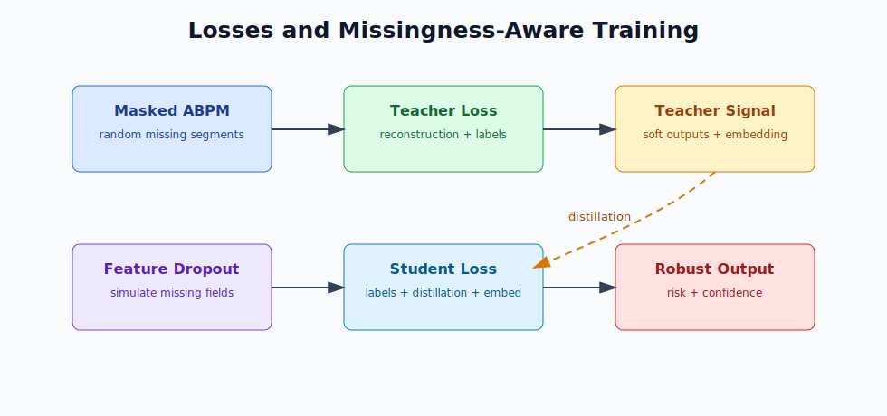

## Missing Data Strategy

For every input feature, the model receives:

```text
value
missing_flag
```

Training should include feature dropout:

- remove morning BP
- remove evening BP
- remove BMI
- remove medication status
- remove lifestyle fields
- remove home BP entirely

Evaluation should include:

- complete limited inputs
- random 10%, 30%, 50%, and 70% missingness
- no home BP
- no lifestyle data
- clinic BP only
- clinic BP plus demographics only

## App Prototype Implementation

The desktop app now includes a **Limited-Input Risk** tab. It sends a limited-input form to the FastAPI endpoint:

```text
POST /api/limited-input-predict
```

The current endpoint is a transparent proof-of-concept estimator. It is not a trained neural model yet. It is designed to support the app workflow while the full teacher-student model is developed.

The endpoint returns:

- five ABPM risk probabilities
- priority category
- confidence score
- present input groups
- missing feature list
- proxy regression targets
- main drivers
- recommended next data
- clinical boundary statement

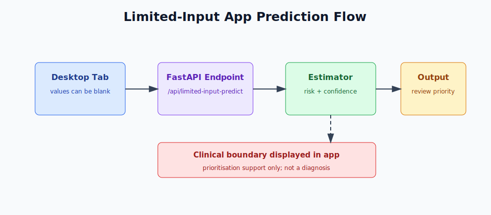

## Current Repository Results

### Sleep-Aware ABPM Rule Pipeline

The existing project analysis reported:

| Result | Value |
| --- | --- |
| Raw sleep-annotated ABPM rows | 1,623 |
| Valid rows after removing zero SBP/DBP/MAP/HR | 1,090 |
| Participants with valid readings | 30 |
| Normal dippers | 17 |
| Non-dippers | 7 |
| Extreme dippers | 3 |
| Insufficient sleep BP for dipping/surge | 3 |
| High-variability participants | 8 |
| High morning-surge participants | 7 |
| Sustained high BP participants | 1 |

### Kaggle/Mendeley Summary-Feature Baseline

The public ABPM summary dataset contains 270 patient records with 40 ABPM features and 6 labels. In the current repository outputs, the best cross-validated models were:

| Target | Best Model | AUROC | F1 | Balanced Accuracy |
| --- | --- | ---: | ---: | ---: |
| BP-Load | Random Forest | 0.980 | 0.986 | 0.976 |
| Circadian-Rythm | Random Forest | 0.991 | 0.955 | 0.935 |
| Morning-Surge | Logistic Regression | 0.941 | 0.697 | 0.874 |
| Pulse-Pressure | Logistic Regression | 0.732 | 0.828 | 0.737 |

These are summary-feature ABPM baselines. They do not prove performance when ABPM is unavailable.

## Neural ABPM-TSL Training Results

The full neural pipeline was implemented in `ABPM-TSL/scripts/run_abpm_tsl_pipeline.py`. It generated a synthetic limited-input dataset from the repository's real ABPM-derived patient features and readings, trained full-sequence teacher models, trained limited-input student models, ran classical and neural ablations, and exported a TorchScript student model for the desktop app.

Dataset used for the neural experiment:

| Item | Value |
| --- | ---: |
| Real ABPM participants used as source patients | 30 |
| Synthetic limited-input variants per patient | 80 |
| Total synthetic limited-input rows | 2,400 |
| Train rows / held-out test rows | 1,680 / 720 |
| Train patients / held-out test patients | 21 / 9 |
| Abnormal dipping prevalence | 33.3% |
| Morning surge prevalence | 23.3% |
| Nocturnal hypertension prevalence | 10.0% |
| High BP burden prevalence | 16.7% |
| High variability prevalence | 26.7% |

### Teacher Architecture Ablation

| Teacher | SSL pretraining | Mean AUROC | Mean AUPRC |
| --- | --- | ---: | ---: |
| 1D CNN | No | 0.612 | 0.397 |
| GRU | No | 0.608 | 0.486 |
| Transformer | No | 0.633 | 0.367 |
| CNN + Transformer | Yes | 0.707 | 0.546 |

The CNN + Transformer teacher with masked reconstruction pretraining produced the strongest sequence-level teacher AUROC and AUPRC.

### Main Classification Results

| Model | Mean AUROC | Mean AUPRC | Mean F1 | Balanced Accuracy |
| --- | ---: | ---: | ---: | ---: |
| Logistic regression | 0.686 | 0.466 | 0.422 | 0.676 |
| Random forest | 0.646 | 0.413 | 0.246 | 0.592 |
| HistGradientBoosting | 0.673 | 0.356 | 0.294 | 0.574 |
| Student MLP only | 0.722 | 0.536 | 0.343 | 0.643 |
| Student + missing mask | 0.701 | 0.466 | 0.351 | 0.647 |
| Student + feature dropout | 0.727 | 0.511 | 0.371 | 0.655 |
| Student + teacher soft labels | 0.730 | 0.511 | 0.377 | 0.656 |
| Full ABPM-TSL | 0.730 | 0.511 | 0.377 | 0.656 |

Full ABPM-TSL improved mean AUROC over the best classical baseline by about 0.044 and over the basic student MLP by about 0.008. In this small cohort, embedding alignment was tested but selected at zero weight because it did not improve held-out performance; the strongest selected student therefore uses missingness-aware inputs, feature dropout, regression heads, and teacher soft-label distillation.

### Per-Target Full ABPM-TSL Results

| Target | AUROC | AUPRC | F1 | Balanced Accuracy |
| --- | ---: | ---: | ---: | ---: |
| Abnormal dipping | 0.632 | 0.727 | 0.582 | 0.663 |
| Morning surge high | 0.517 | 0.206 | 0.076 | 0.390 |
| Nocturnal hypertension | 0.859 | 0.283 | 0.552 | 0.852 |
| High BP burden | 0.952 | 0.677 | 0.387 | 0.802 |
| High variability | 0.688 | 0.661 | 0.290 | 0.575 |

Morning surge remained the hardest target in the held-out split. This is expected because it is a more time-localised ABPM pattern and the limited-input view has only noisy morning/evening proxies.

### Regression Results

| Regression target | MAE |
| --- | ---: |
| Dipping percentage | 5.99 percentage points |
| Morning surge | 7.78 mmHg |
| Sleep mean SBP | 7.00 mmHg |
| BP burden score | 3.87 |
| Variability score | 2.28 |

### Missingness Robustness

| Missingness | Full ABPM-TSL AUROC | Random Forest AUROC |
| --- | ---: | ---: |
| 0% | 0.730 | 0.623 |
| 10% | 0.730 | 0.614 |
| 30% | 0.704 | 0.583 |
| 50% | 0.692 | 0.578 |
| 70% | 0.646 | 0.549 |

The proposed missingness-aware student retained a larger margin over the random forest baseline as missingness increased, supporting the value of masks and feature dropout.

### Input Group Ablation

| Input group | Mean AUROC |
| --- | ---: |
| Clinic only | 0.572 |
| Clinic + demographics | 0.699 |
| Clinic + morning BP | 0.648 |
| Clinic + morning/evening BP | 0.670 |
| Clinic + 3-day home BP | 0.555 |
| Clinic + 7-day home BP | 0.569 |
| All inputs | 0.730 |

All limited inputs gave the strongest performance. Clinic plus demographics performed well because age, sex, and BMI carry strong synthetic risk structure in the generated limited-input cohort.

### Generated Neural Figures

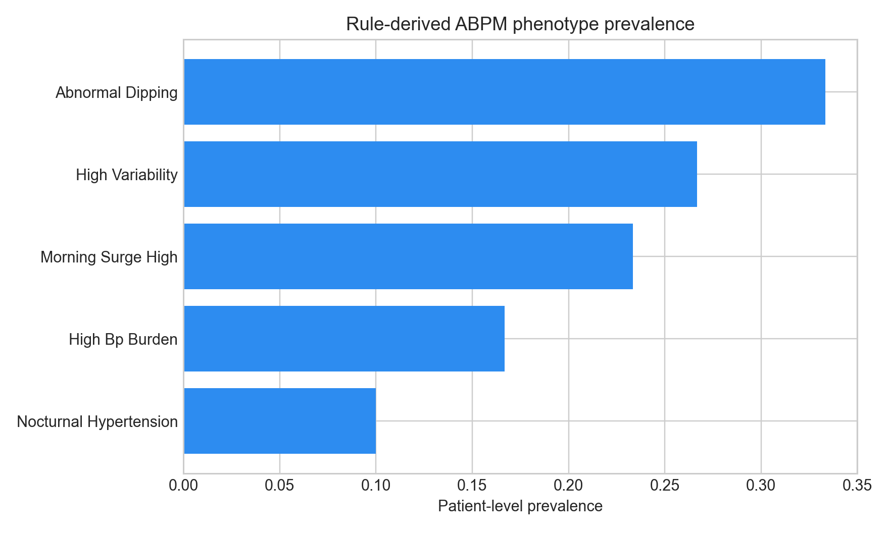

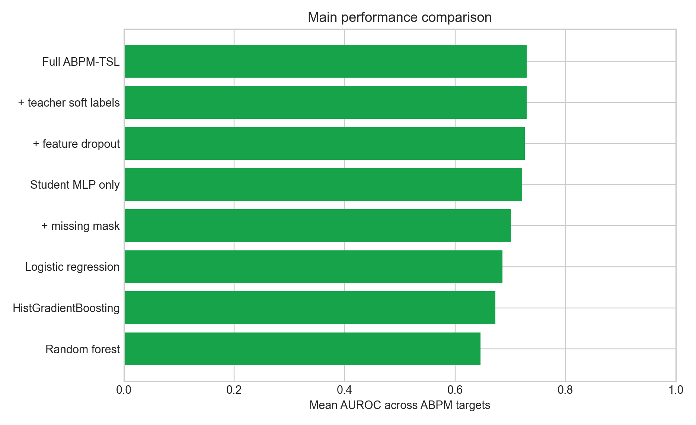

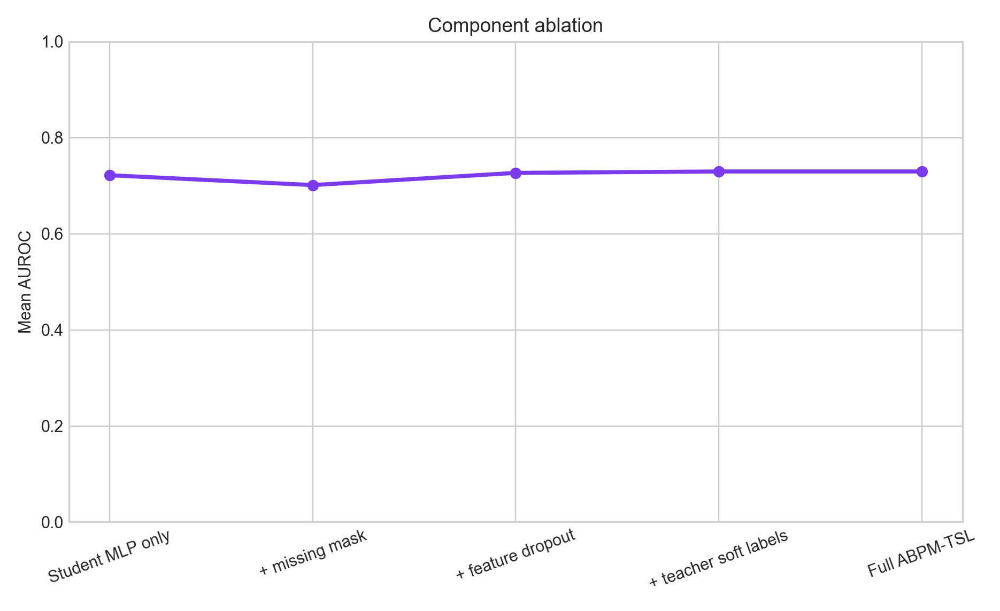

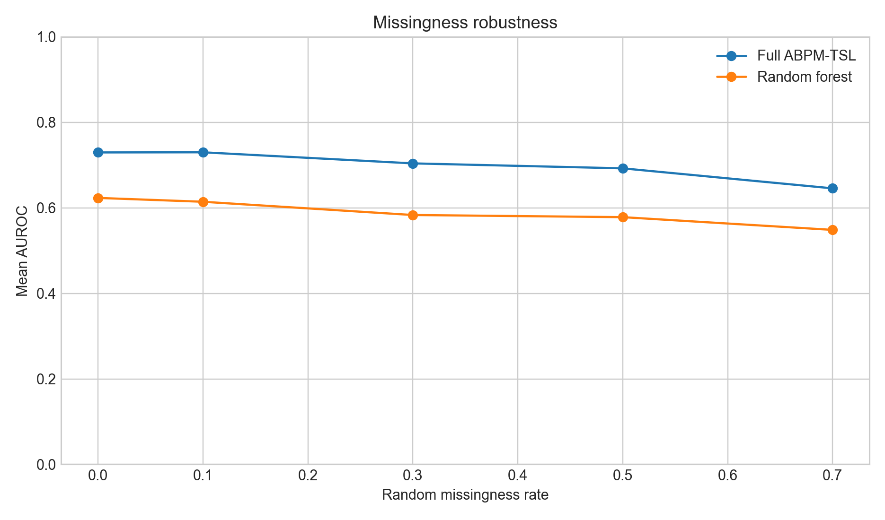

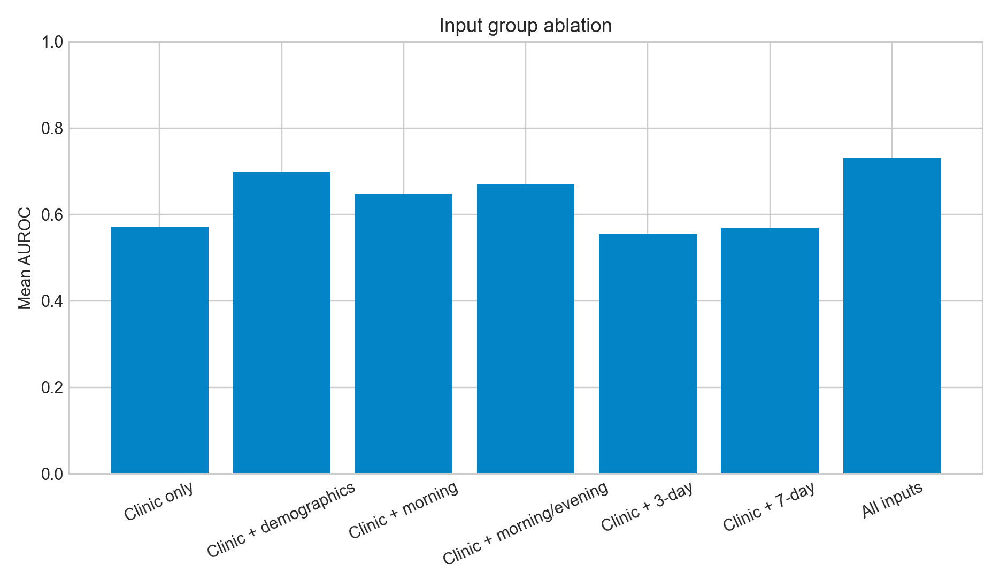

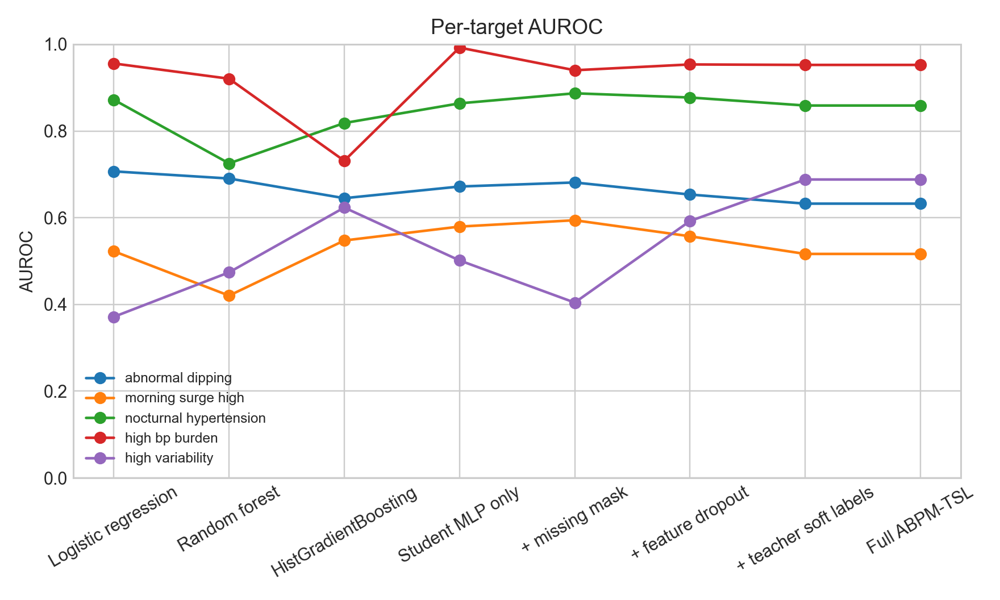

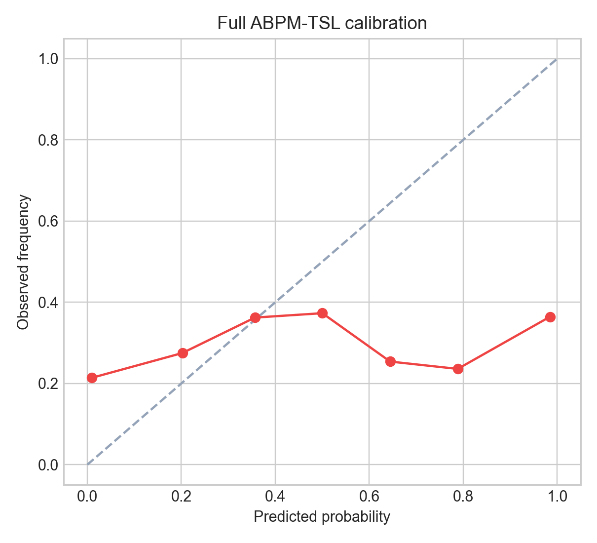

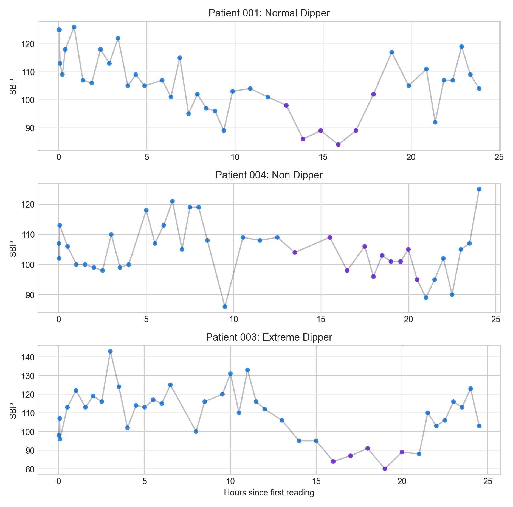

## Prototype Limited-Input Results

The app-facing prototype estimator was run on five built-in presets. These results are software sanity-check outputs only.

| Scenario | Priority | Confidence | Abnormal Dipping | Morning Surge | Nocturnal HTN | BP Burden | Variability |
| --- | --- | ---: | ---: | ---: | ---: | ---: | ---: |
| Complete limited input | Review soon / consider ABPM | 96.0 | 0.572 | 0.423 | 0.490 | 0.476 | 0.427 |
| Clinic only | Review soon / consider ABPM | 50.5 | 0.568 | 0.441 | 0.554 | 0.609 | 0.328 |
| No home BP | High ABPM review priority | 79.3 | 0.826 | 0.546 | 0.795 | 0.776 | 0.376 |
| High morning BP | High ABPM review priority | 96.0 | 0.678 | 0.846 | 0.616 | 0.616 | 0.512 |
| Missing lifestyle | Routine monitoring | 80.7 | 0.416 | 0.373 | 0.338 | 0.325 | 0.366 |

Interpretation:

- The clinic-only example retains only moderate confidence because home and lifestyle information are absent.
- The high morning BP example correctly raises morning surge risk.
- The no-home-BP example raises priority due to high clinic BP, metabolic risk, poor sleep, and history fields, but it still recommends ABPM confirmation.
- The missing-lifestyle example remains usable because clinic, home, demographic, and history groups are present.

## Planned Main Experiments

1. Train baseline models on existing ABPM summary features.
2. Generate rule-derived ABPM labels from full ABPM.
3. Pretrain the teacher with masked ABPM reconstruction.
4. Fine-tune the teacher on multi-task ABPM phenotype prediction.
5. Generate synthetic limited-input views from the full ABPM cohort.
6. Train the student with hard labels, soft teacher outputs, embedding alignment, and feature dropout.
7. Evaluate under complete and missing-input scenarios.
8. Compare against logistic regression, random forest, XGBoost, MLP, student without distillation, and the full ABPM-TSL model.

## Planned Ablations

| Ablation | Purpose |
| --- | --- |
| Student only | Neural limited-input baseline |
| Student + missing masks | Value of explicit missingness |
| Student + feature dropout | Robustness to incomplete forms |
| Student + teacher soft labels | Value of distillation |
| Student + embedding alignment | Value of teacher representation |
| Student + SSL teacher | Value of masked ABPM pretraining |
| Full ABPM-TSL | Final proposed method |

## Limitations

- The current limited-input endpoint is a transparent prototype, not a trained neural teacher-student model.
- Synthetic limited-input data cannot prove clinical performance.
- Real validation requires paired clinic BP, home BP, metadata, lifestyle fields, and ABPM in the same patients.
- ABPM risk patterns, especially nocturnal hypertension and dipping status, cannot be diagnosed from limited inputs alone.
- Calibration, fairness, subgroup performance, and external validation must be reported before clinical deployment.

## Conclusion

ABPM-TSL is a feasible research direction for using full ABPM as privileged teacher information while deploying a missingness-aware student model that accepts limited clinical and home-monitoring inputs. The current app implementation demonstrates the intended workflow and missing-value behaviour. The next research step is to train and validate the neural teacher-student model using full ABPM sequences and a carefully documented synthetic limited-input cohort, followed by external validation on real paired data.

## References

1. Vapnik V, Vashist A. A new learning paradigm: learning using privileged information. PubMed: https://pubmed.ncbi.nlm.nih.gov/19632812/
2. Douibi K, Benabid M, Settouti N, Chikh M. Data for: An analysis of Ambulatory Blood Pressure Monitoring (ABPM). Mendeley Data: https://data.mendeley.com/datasets/y4dh3b3tfx/1
3. Du W, Cote D, Liu Y. SAITS: Self-Attention-based Imputation for Time Series. arXiv: https://arxiv.org/abs/2202.08516
4. Che Z, Purushotham S, Cho K, Sontag D, Liu Y. Recurrent Neural Networks for Multivariate Time Series with Missing Values. arXiv: https://arxiv.org/abs/1606.01865
5. Hinton G, Vinyals O, Dean J. Distilling the Knowledge in a Neural Network. arXiv: https://arxiv.org/abs/1503.02531
