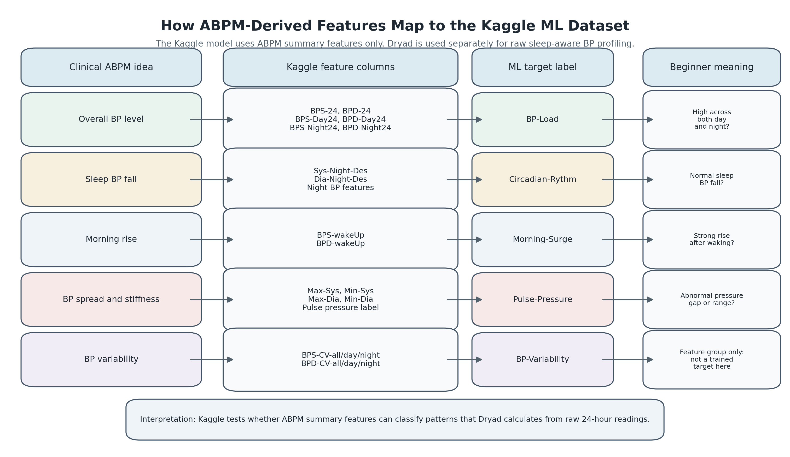

# Sleep-Aware Blood Pressure Profiling Framework

This project builds a **sleep-aware blood pressure profiling framework** for personalised hypertension monitoring.

It uses two datasets, but they do different jobs:

- **Dryad dataset**: builds the actual sleep-aware BP framework from raw 24-hour ABPM readings.
- **Kaggle dataset**: trains and evaluates the machine-learning models using ABPM summary features.

Important: the ML models are trained **only on the Kaggle dataset**. Dryad and Kaggle are not merged row-by-row because they are different participant cohorts.

## Why Two Datasets?

The datasets complement each other:

| Dataset | Main role | Why it matters |
|---|---|---|
| Dryad 24-hour physiological monitoring | Framework development | Has raw ABPM readings, sleep/wake labels, HR, MAP, PP and participant metadata |
| Kaggle ABPM summary dataset | ML modelling | Has more rows and ready-made ABPM labels for model training |

Simple view:

```text
Dryad = builds the clinical framework
Kaggle = tests the machine-learning idea
```

More detailed view:

```text
Dryad raw 24-hour ABPM data
        |
        v
Clean invalid BP readings
        |
        v
Separate awake vs sleep BP
        |
        v
Calculate dipping, morning surge and BP variability
        |
        v
Create personalised BP profiles
        |
        v
Clinician-review monitoring recommendation
```

```text
Kaggle ABPM summary features
        |
        v
Use existing ABPM-derived features
        |
        v
Train logistic regression and random forest models
        |
        v
Predict abnormal ABPM labels
        |
        v
Save metrics, confusion matrices and model files
```

So the combined contribution is:

```text
Dryad explains the 24-hour physiology
        +
Kaggle supports the ML classification evidence
        =
Sleep-aware BP profiling framework with ML support
```

## How ABPM Features Map to Kaggle ML

The Kaggle dataset does not contain raw 24-hour BP curves like Dryad. Instead, it contains **ABPM-derived summary features** such as 24-hour BP averages, day/night BP values, night-time descent, coefficient of variation and wake-up BP.

These summary features are used to train the ML models.



The figure can be regenerated with:

```bash
python scripts/create_abpm_feature_mapping_figure.py
```

## Full Project Flow

```text
                +-----------------------------+
                |  Dryad sleep-aware ABPM     |
                |  raw BP + sleep/wake labels |
                +-------------+---------------+
                              |
                              v
                +-----------------------------+
                |  BP feature extraction      |
                |  dipping, surge, variability|
                +-------------+---------------+
                              |
                              v
                +-----------------------------+
                |  Personal BP profiles       |
                |  monitoring recommendation  |
                +-----------------------------+


                +-----------------------------+
                |  Kaggle ABPM summary data   |
                |  features + labels          |
                +-------------+---------------+
                              |
                              v
                +-----------------------------+
                |  Machine-learning models    |
                |  Logistic Reg + RandomForest|
                +-------------+---------------+
                              |
                              v
                +-----------------------------+
                |  AUROC, F1, confusion matrix|
                |  saved .joblib models       |
                +-----------------------------+
```

## How a New Patient Is Handled

For a new patient, the framework plots the 24-hour BP curve, extracts sleep-aware BP features, compares the patient with clinically defined thresholds and reference distributions, and assigns an interpretable BP profile.

Machine learning is used only as a supporting analysis, not as the main decision method.

Example new-patient values:

| Feature | Value |
|---|---|
| Awake mean SBP | 140 mmHg |
| Sleep mean SBP | 138 mmHg |
| Dipping percentage | 1.4% |
| Morning surge | 24 mmHg |
| SBP variability | High |

Example output:

```text
Profile:
Non-dipper with morning surge and high variability

Review point:
Review night BP, sleep quality, adherence, caffeine or stress triggers,
and medication timing with clinician.
```


The figure shows three parts:

- line graph: how BP changes over 24 hours
- profile plot: where the patient lies compared with BP profile regions
- report card: what the clinician should review next

Regenerate this figure with:

```bash
python scripts/create_new_patient_framework_figure.py
```

## BP Profiles

| Profile | Meaning |
|---|---|
| Normal dipper | Sleep SBP falls by 10-20% |
| Non-dipper | Sleep SBP fall is below 10% |
| Reverse dipper | Sleep SBP is higher than awake SBP |
| Extreme dipper | Sleep SBP falls by more than 20% |
| Morning surge | SBP rises after waking |
| Sustained high BP | BP remains high across day and night |

## What the Pipeline Produces

```text
Run script
   |
   v
outputs/
   |
   |-- Dryad cleaned BP readings
   |-- Dryad participant BP profiles
   |-- Kaggle ML metrics
   |-- Kaggle confusion matrices
   |-- Kaggle classification reports
   |-- Kaggle cross-validated predictions
   |-- saved ML models
   |-- generated figures
```

Main output files:

```text
outputs/
|-- dryad_participant_features.csv
|-- dryad_valid_bp_readings.csv
|-- kaggle_model_metrics.csv
|-- kaggle_confusion_matrices.csv
|-- kaggle_classification_reports.csv
|-- kaggle_cv_predictions.csv
|-- kaggle_feature_importance.csv
|-- analysis_summary.md
|-- models/
|   |-- *.joblib
|-- figures/
|   |-- confusion_matrices/
```

## Dataset Placement

Datasets are not committed to this repository. Place them beside `sleep_aware_bp_framework.py`:

```text
personalised-bp-monitoring/
|-- sleep_aware_bp_framework.py
|-- 24-hour physiological monitoring/
|   |-- Blood_Pressure_Sleep_Info.xlsx
|   |-- Participant_Information.csv
|   |-- Data_Collection_Notes.csv
|-- Kaggle dataset/
|   |-- y4dh3b3tfx-1/
|       |-- ABPM-dataset.arff
```

## Run

```bash
pip install -r requirements.txt
python sleep_aware_bp_framework.py
```

Run tests:

```bash
python -m unittest -v
```

## Machine-Learning Models

The ML section uses only the **Kaggle ABPM dataset**.

Models:

- logistic regression
- random forest

Targets:

- `Circadian-Rythm`
- `Pulse-Pressure`
- `BP-Load`
- `Morning-Surge`

For each target/model pair, the pipeline saves:

- model metrics
- cross-validated predictions
- confusion matrix values
- confusion matrix plots
- final `.joblib` model

## Clinical Boundary

This is a research and monitoring-support framework. It should not be used to automatically change antihypertensive medication.
