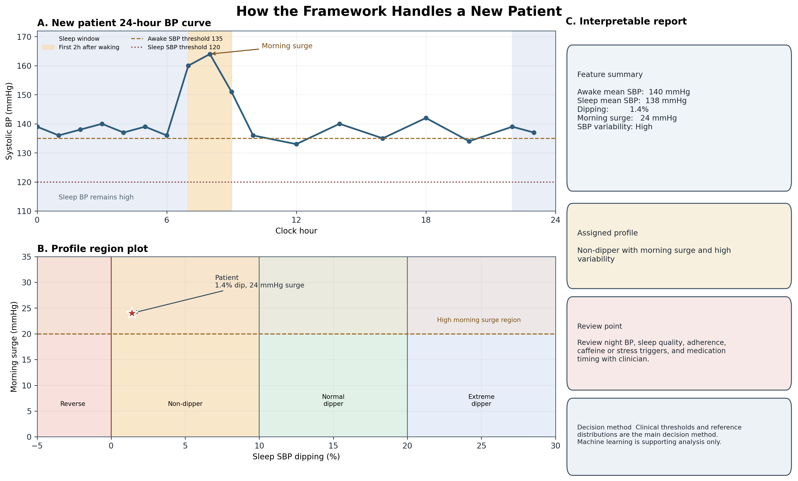

# Sleep-Aware Blood Pressure Profiling Framework

What this project does:
This project converts raw 24-hour Ambulatory Blood Pressure Monitoring (ABPM) data into an interactive, sleep-aware patient profile for doctors.

Why it is useful for doctors:
ABPM devices capture detailed 24-hour data, which is difficult to interpret. This framework automates the feature extraction, flags risky patterns (like reverse dipping, morning surges, or high pulse pressure), and displays the patient's individual profile in an interactive web application.

How a new patient is analysed:
1. Patient wears a 24-hr device
2. Doctor uploads the standard CSV file (Time, Sys, Dia, HR)
3. Framework parses raw readings and identifies night/day (either by patient diary or actigraphy)
4. Framework generates the interactive clinical report.

Rule-Based Patient Pattern Flags:
The framework applies rules to flag high clinical risk patterns (e.g. Non-dipping, Reverse dipping, Morning surge, Isolated nocturnal hypertension).

This project builds a **sleep-aware blood pressure profiling framework** for personalised hypertension monitoring.

It uses two datasets, but they do different jobs:

- **Dryad dataset**: builds the actual sleep-aware BP framework from raw 24-hour ABPM readings.
- **Kaggle dataset**: trains and evaluates the machine-learning models using ABPM summary features.

Important: the ML models are trained **only on the Kaggle dataset**. Dryad and Kaggle are not merged row-by-row because they are different participant cohorts.

## Why Two Datasets?

The datasets complement each other:

| Dataset | Main role | Why it matters |
|---|---|---|
| Dryad 24-hour physiological monitoring | Framework development | Has raw ABPM readings, sleep/wake labels, HR, MAP, PP and participant metadata |
| Kaggle ABPM summary dataset | ML modelling | Has more rows and ready-made ABPM labels for model training |

Simple view:

```text
Dryad = builds the clinical framework
Kaggle = tests the machine-learning idea
```

More detailed view:

```text
Dryad raw 24-hour ABPM data
        |
        v
Clean invalid BP readings
        |
        v
Separate awake vs sleep BP
        |
        v
Calculate dipping, morning surge and BP variability
        |
        v
Create personalised BP profiles
        |
        v
Clinician-review monitoring recommendation
```

```text
Kaggle ABPM summary features
        |
        v
Use existing ABPM-derived features
        |
        v
Train logistic regression and random forest models
        |
        v
Predict abnormal ABPM labels
        |
        v
Save metrics, confusion matrices and model files
```

So the combined contribution is:

```text
Dryad explains the 24-hour physiology
        +
Kaggle supports the ML classification evidence
        =
Sleep-aware BP profiling framework with ML support
```

## Full Project Flow

```text
                +-----------------------------+
                |  Dryad sleep-aware ABPM     |
                |  raw BP + sleep/wake labels |
                +-------------+---------------+
                              |
                              v
                +-----------------------------+
                |  BP feature extraction      |
                |  dipping, surge, variability|
                +-------------+---------------+
                              |
                              v
                +-----------------------------+
                |  Personal BP profiles       |
                |  monitoring recommendation  |
                +-----------------------------+


                +-----------------------------+
                |  Kaggle ABPM summary data   |
                |  features + labels          |
                +-------------+---------------+
                              |
                              v
                +-----------------------------+
                |  Machine-learning models    |
                |  Logistic Reg + RandomForest|
                +-------------+---------------+
                              |
                              v
                +-----------------------------+
                |  AUROC, F1, confusion matrix|
                |  saved .joblib models       |
                +-----------------------------+
```

## How a New Patient Is Handled

For a new patient, the framework plots the 24-hour BP curve, extracts sleep-aware BP features, compares the patient with clinically defined thresholds and reference distributions, and assigns an interpretable BP profile.

Machine learning is used only as a supporting analysis, not as the main decision method.

Example new-patient values:

| Feature | Value |
|---|---|
| Awake mean SBP | 140 mmHg |
| Sleep mean SBP | 138 mmHg |
| Dipping percentage | 1.4% |
| Morning surge | 24 mmHg |
| SBP variability | High |

Example output:

```text
Profile:
Non-dipper with morning surge and high variability

Review point:
Review night BP, sleep quality, adherence, caffeine or stress triggers,
and medication timing with clinician.
```



**Figure. Interpretable new-patient BP profiling with ML support validation.**

The new-patient report is generated using rule-based sleep-aware ABPM features, including dipping percentage, morning surge and BP variability. The Kaggle ABPM dataset is used separately to test whether related ABPM feature groups can classify abnormal BP pattern labels. The ML component supports feature relevance but does not replace clinician judgement.

The figure shows four parts:

- line graph: how BP changes over 24 hours
- profile plot: where the patient lies compared with BP profile regions
- report card: what the clinician should review next
- separate ML support validation: whether similar ABPM feature groups can classify related BP pattern labels in Kaggle

ML support is not used to make the final clinical decision. It provides separate evidence that ABPM feature groups are useful for classifying related BP patterns.

Regenerate this figure with:

```bash
python scripts/create_new_patient_framework_figure.py
```

## Sleep-Aware BP Report Dashboard

The clinical prototype is a **doctor-first, patient-understandable dashboard**. It uses the rule-based Dryad-derived framework and hides machine-learning terms from the clinical interface.

The ML validation table is for the paper, README and research presentation only. It is not shown to doctors or patients in the dashboard.

```text
New patient ABPM file
        |
        v
Automatic sleep-aware feature calculation
        |
        v
Doctor dashboard
        |
        v
Patient-friendly report preview
        |
        v
PDF report for clinical review
```

Run the dashboard:

```bash
streamlit run sleep_aware_bp_report_app.py
```

The app includes an example patient, so it can be opened before uploading new data. For uploaded data, use a CSV or Excel file with at least:

```text
Time, Systolic, Diastolic
```

Optional columns:

```text
Patient_ID, Patient_Name, Age, Sex, BMI, ABPM_Date,
Day_Date, MAP, PP, HR, Wake_Sleep
```

If patient details are included in the file, the Streamlit and desktop apps load them automatically. If `Wake_Sleep` is missing, the app uses the sleep start and wake time entered in the sidebar.

Sample upload files are included here:

```text
Sample Patient Inputs/
|-- TEMPLATE_ABPM_with_patient_details.csv
|-- sample_01_normal_dipper.csv
|-- ...
|-- sample_10_limited_sleep_data.csv
```

Use the template to see the expected format. The 10 sample patients are fictional and are only for testing the dashboard.

Dashboard flow:

```text
Doctor dashboard
        |
        |-- summary cards: 24h BP, awake BP, sleep BP, dipping, surge, variability
        |-- 24-hour BP curve: systolic/diastolic BP, sleep shading, morning period
        |-- profile plot: sleep dipping % vs morning surge
        |-- pattern flags: non-dipper, morning surge, high variability, sustained high BP
        |-- review points: what the clinician should check next
```

The **Ask About This BP Report** tab lets users ask quick or custom questions about the calculated profile. It sends only the report summary to Gemma, not raw ABPM rows, and returns safe explanatory text rather than medication advice.

## Gemma Assistant

The **Ask About This BP Report** assistant uses Hugging Face Gemma to explain the calculated report summary only. It does not receive raw ABPM rows and does not diagnose, prescribe or recommend medication changes.

For Gemma access, set a Hugging Face token once as `HF_TOKEN` or save it through the CLI:

```bash
python ask_bp_report.py --save-token
python ask_bp_report.py --question "Why is this patient flagged?"
```

In Streamlit, open the **Ask About This BP Report** tab after a patient has been analysed. There is no model selector in the app.

## ML Support

The patient profile is assigned by transparent clinical rules. ML is used only as separate support evidence on the Kaggle ABPM dataset.

| Patient feature | Kaggle ML target | Purpose |
|---|---|---|
| Dipping / sleep BP fall | `Circadian-Rythm` | Tests day-night rhythm feature value |
| Morning surge | `Morning-Surge` | Tests wake-up BP rise feature value |
| High BP burden | `BP-Load` | Tests 24h/day/night BP feature value |
| Pulse pressure | `Pulse-Pressure` | Tests SBP-DBP gap feature value |

The ML model does **not** validate a new patient directly. It shows that similar ABPM feature groups can classify related BP pattern labels in a separate labelled dataset.

## BP Profiles

| Profile | Meaning |
|---|---|
| Normal dipper | Sleep SBP falls by 10-20% |
| Non-dipper | Sleep SBP fall is below 10% |
| Reverse dipper | Sleep SBP is higher than awake SBP |
| Extreme dipper | Sleep SBP falls by more than 20% |
| Morning surge | SBP rises after waking |
| Sustained high BP | BP remains high across day and night |

## Data And Outputs

Datasets are not committed. Place them like this:

```text
personalised-bp-monitoring/
|-- 24-hour physiological monitoring/
|   |-- Blood_Pressure_Sleep_Info.xlsx
|   |-- Participant_Information.csv
|   |-- Data_Collection_Notes.csv
|-- Kaggle dataset/
|   |-- y4dh3b3tfx-1/
|       |-- ABPM-dataset.arff
```

Main generated outputs are saved in `outputs/`, including Dryad participant features, valid BP readings, Kaggle metrics, confusion matrices, feature importance, model files and figures.

## Run

```bash
pip install -r requirements.txt
python sleep_aware_bp_framework.py
streamlit run sleep_aware_bp_report_app.py
python -m unittest -v
```

## Clinical Boundary

This is a research and monitoring-support framework. It supports clinician review but should not be used to automatically change antihypertensive medication.
