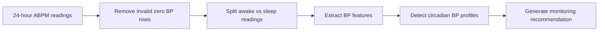
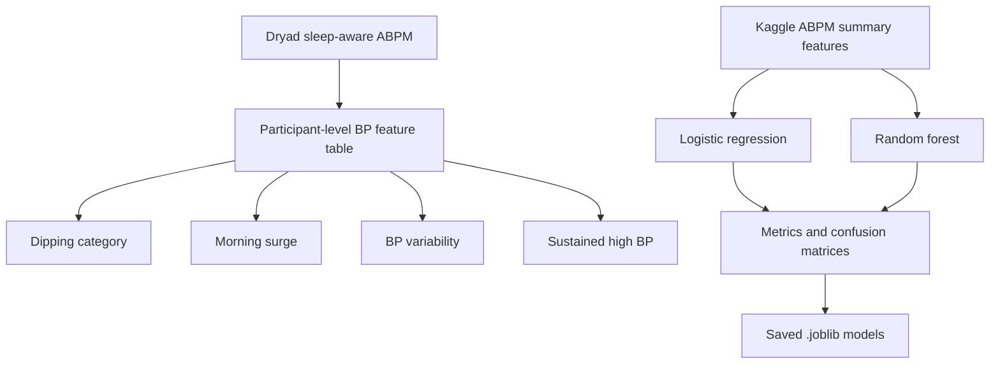
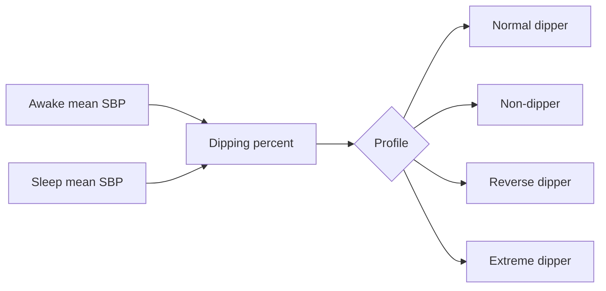
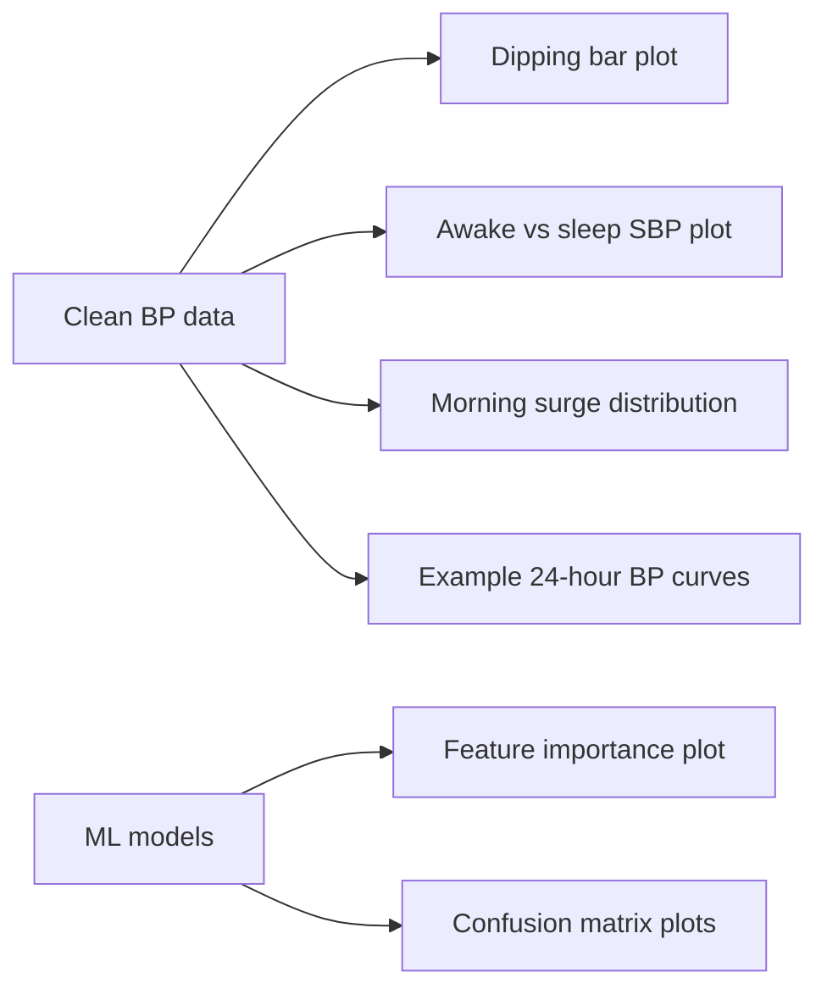

# Sleep-Aware Blood Pressure Profiling Framework

This repository implements a reproducible BP-first framework for personalised hypertension monitoring.

It uses 24-hour ABPM readings with sleep/wake labels to build interpretable circadian BP profiles, then uses a second ABPM summary dataset for baseline machine-learning classification.

The output is designed for clinician-review support, not automatic medication advice.

## Full Framework



## What We Analyse



## BP Profile Logic



Main detected profiles:

| Profile | Meaning |
|---|---|
| Normal dipper | Sleep SBP falls by 10-20% |
| Non-dipper | Sleep SBP fall is below 10% |
| Reverse dipper | Sleep SBP is higher than awake SBP |
| Extreme dipper | Sleep SBP falls by more than 20% |
| Morning surge | SBP rises after waking |
| Sustained high BP | BP remains high across day and night |

## Generated Plots and Outputs

```text
outputs/
|-- dryad_participant_features.csv
|-- dryad_valid_bp_readings.csv
|-- kaggle_model_metrics.csv
|-- kaggle_confusion_matrices.csv
|-- kaggle_classification_reports.csv
|-- kaggle_cv_predictions.csv
|-- kaggle_feature_importance.csv
|-- analysis_summary.md
|-- models/
|   |-- *.joblib
|-- figures/
|   |-- figure_1_framework_pipeline.png
|   |-- figure_2_dipping_categories.png
|   |-- figure_3_awake_vs_sleep_sbp.png
|   |-- figure_4_morning_surge_distribution.png
|   |-- figure_5_example_bp_curves.png
|   |-- figure_6_kaggle_feature_importance.png
|   |-- figure_7_clinical_monitoring_pathway.png
|   |-- confusion_matrices/
```

Plot flow:



## Datasets

Datasets are not committed to this repository. Place them beside `sleep_aware_bp_framework.py`:

```text
personalised-bp-monitoring/
|-- sleep_aware_bp_framework.py
|-- 24-hour physiological monitoring/
|   |-- Blood_Pressure_Sleep_Info.xlsx
|   |-- Participant_Information.csv
|   |-- Data_Collection_Notes.csv
|-- Kaggle dataset/
|   |-- y4dh3b3tfx-1/
|       |-- ABPM-dataset.arff
```

## Run

```bash
pip install -r requirements.txt
python sleep_aware_bp_framework.py
```

Run tests:

```bash
python -m unittest -v
```

## Models

The Kaggle dataset is used to train:

- logistic regression
- random forest

Targets:

- `Circadian-Rythm`
- `Pulse-Pressure`
- `BP-Load`
- `Morning-Surge`

For each target/model pair, the pipeline saves metrics, cross-validated predictions, confusion matrices and a final `.joblib` model.

## Clinical Boundary

This is a research and monitoring-support framework. It should not be used to automatically change antihypertensive medication.
