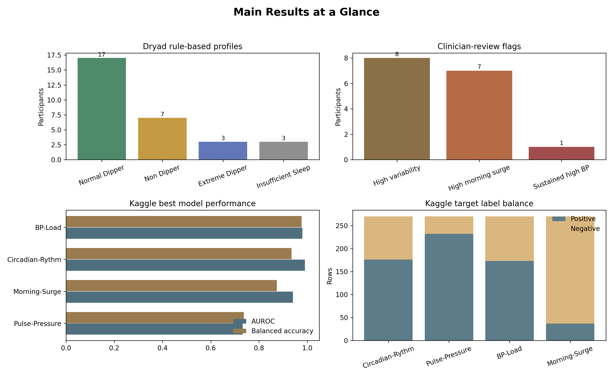

# A Sleep-Aware Blood Pressure Profiling Framework for Personalised Hypertension Monitoring

**Free-format research manuscript draft**

## Authors

Pasindu Maninka and collaborators

## Short Title

Sleep-aware BP profiling from ambulatory monitoring

## Abstract

**Background.** Hypertension management usually depends on clinic blood pressure (BP), home BP, and treatment review. However, BP is not constant across the day. Night-time BP, insufficient sleep-related BP fall, morning BP surge, and high BP variability can reveal patterns that a single clinic value cannot show. This matters in Sri Lanka and similar health systems because hypertension is common, BP control remains incomplete, and clinician time is limited.

**Objective.** We developed a sleep-aware BP profiling framework that converts 24-hour ambulatory blood pressure monitoring (ABPM) readings into interpretable circadian BP profiles and clinician-review points.

**Methods.** The primary dataset was a 24-hour physiological monitoring dataset with raw ABPM readings, sleep/wake state, systolic BP, diastolic BP, mean arterial pressure, pulse pressure, heart rate, participant information, and data-quality notes. Invalid rows with zero SBP, DBP, MAP, or HR were removed. Participant-level features were calculated: 24-hour mean BP, awake mean BP, sleep mean BP, dipping percentage, morning surge, SBP variability, pulse pressure, MAP, and HR-BP correlation. Profiles were assigned using transparent rules: normal dipper, non-dipper, reverse dipper, extreme dipper, sustained high BP, high variability, and morning surge. A separate Kaggle ABPM `.arff` dataset was used only for supporting machine-learning validation of related ABPM feature groups. Logistic regression and random forest models were trained for `Circadian-Rythm`, `Pulse-Pressure`, `BP-Load`, and `Morning-Surge`.

**Results.** The Dryad physiological dataset contained 1,623 ABPM rows. After zero-value filtering, 1,090 valid readings remained across 30 participants. Three participants had insufficient valid sleep BP readings for dipping and morning-surge analysis. Among 30 participants, 17 were normal dippers, 7 were non-dippers, 3 were extreme dippers, and 3 had insufficient sleep BP data. Eight participants were flagged for high SBP variability, seven for high morning surge, and one for sustained high BP. The Kaggle ABPM dataset contained 270 rows and 39 attributes. Best cross-validated performance was strongest for BP load and circadian rhythm: BP-Load random forest AUROC 0.980, F1 0.986, balanced accuracy 0.976; Circadian-Rythm random forest AUROC 0.991, F1 0.955, balanced accuracy 0.935. Morning-Surge was imbalanced but remained informative with logistic regression AUROC 0.941, F1 0.697, balanced accuracy 0.874.

**Conclusion.** The framework provides a practical, interpretable way to move from raw 24-hour ABPM readings to sleep-aware BP profiles and safe clinician-review points. The new-patient report remains rule-based. Machine learning is used as separate supporting validation, showing that related ABPM feature groups have predictive value for abnormal BP pattern labels.

## Keywords

Hypertension; ambulatory blood pressure monitoring; nocturnal hypertension; non-dipping; morning surge; blood pressure variability; Sri Lanka; clinician decision support; interpretable machine learning.

## Plain-Language Summary

Blood pressure changes during the day and night. Some people have BP that stays high during sleep, does not fall enough at night, rises strongly after waking, or changes too much across the day. These patterns may be missed if care looks only at one clinic BP value.

This project builds a simple framework that:

1. reads 24-hour ABPM data,
2. separates awake and sleep readings,
3. calculates clinically understandable BP features,
4. assigns a transparent BP profile, and
5. gives safe review points for the doctor.

The system does **not** tell patients to change medicine. It says what the clinician should review next.

## Introduction

Hypertension remains one of the most important modifiable drivers of cardiovascular disease, stroke, kidney disease, and premature death. In Sri Lanka, the problem is not only detection but also sustained control. A nationally representative analysis of Sri Lankan adults reported a weighted hypertension prevalence of 27.6%; among adults with hypertension, only 44.2% were treated and 20.0% were controlled. The same work concluded that the largest cascade losses occur at diagnosis and at control after treatment. The WHO Sri Lanka hypertension profile estimated 4.3 million adults aged 30-79 years living with hypertension in 2019 and noted that 1.5 million more people would need effective treatment to reach a 50% control rate.

This creates a practical problem for clinical care: many patients have "poor control", but the reason is not always visible from one clinic BP measurement. BP may be acceptable in clinic but high during sleep, high in the early morning, or unstable across the day. ABPM can measure BP during ordinary daily life and sleep. The 2023 European Society of Hypertension guideline describes ABPM as useful because it captures daily activity and sleep, quantifies BP variability and morning surge, and can assess nocturnal dipping. The guideline also notes that night BP and lack of night-time BP reduction have strong prognostic relevance. The 2017 ACC/AHA framework gives commonly used ABPM review thresholds: 24-hour BP 130/80 mmHg, daytime or awake BP 135/85 mmHg, and night-time or asleep BP 120/70 mmHg.

### Literature Gap

Current ABPM outputs often remain technical. They may report many numbers but do not always convert them into simple, patient-specific monitoring guidance. In Sri Lanka and other resource-constrained settings, the clinical need is not a black-box model that suggests medication changes. The more realistic need is an interpretable report that shows:

- when BP is high,
- whether BP falls during sleep,
- whether BP rises after waking,
- whether BP is unstable,
- whether data quality is adequate, and
- what the clinician should review next.

This study addresses that gap by building a sleep-aware, rule-based BP profiling framework with a separate machine-learning support analysis.

## Study Aim

This study aims to develop a sleep-aware blood pressure profiling framework that identifies circadian BP patterns from ambulatory BP data and supports personalised hypertension monitoring.

## What We Built

The framework has two linked parts:

1. **Clinical framework:** Dryad 24-hour physiological monitoring data are used to build participant-level BP profiles from raw ABPM curves.
2. **Supporting ML validation:** Kaggle ABPM summary data are used separately to test whether similar ABPM feature groups can classify related abnormal BP labels.

The two datasets are **not merged row by row** because they are different cohorts.


**Figure 1.** Overall sleep-aware BP profiling pipeline.

## Methods

### Data Sources

#### Primary Dataset: 24-Hour Physiological Monitoring Dataset

The primary dataset included raw ABPM readings and sleep/wake labels. The main files used were:

- `Blood_Pressure_Sleep_Info.xlsx`
- `Participant_Information.csv`
- `Data_Collection_Notes.csv`

The ABPM file contained participant ID, day/date, time, systolic BP, diastolic BP, MAP, pulse pressure, heart rate, and sleep/wake state. Sleep/wake state was coded as:

- `1 = awake`
- `0 = asleep`

Participant information added age group, sex, BMI, caffeine intake, and alcohol intake. Data collection notes were used to identify known device or collection issues for sensitivity review.

#### Secondary Dataset: Kaggle ABPM Dataset

The Kaggle dataset was an `.arff` file with 270 rows and 39 attributes. It included ABPM-derived summary features and binary labels for:

- `Circadian-Rythm`
- `Pulse-Pressure`
- `BP-Load`
- `Morning-Surge`
- `BP-Variability`

`BP-Variability` was positive for all 270 rows and was therefore not used as a model target.


**Figure 2.** Dryad and Kaggle are complementary, not row-merged.

### Data Cleaning

For the primary ABPM dataset, rows were removed if any of the following were zero:

- SBP
- DBP
- MAP
- HR

This rule was used because zero values are physiologically invalid and would distort averages, dipping percentage, variability, and morning-surge calculations.

### Feature Extraction

For each participant, the following features were calculated:

| Feature | Meaning |
|---|---|
| Valid readings | Number of usable ABPM rows |
| Awake readings | Number of valid awake rows |
| Sleep readings | Number of valid sleep rows |
| 24-hour mean SBP/DBP | Overall BP burden |
| Awake mean SBP/DBP | Daytime or awake BP load |
| Sleep mean SBP/DBP | Night-time or sleep BP load |
| Dipping percentage | Sleep-related SBP fall |
| Morning surge | Mean SBP in first 2 hours after waking minus mean sleep SBP |
| SBP/DBP SD and CV | BP variability |
| Mean PP | Pressure gap |
| Mean MAP | Average arterial pressure load |
| Mean HR | Heart-rate context |
| HR-SBP correlation | Exploratory autonomic or activity-related context |

### Dipping Rule

Dipping percentage was calculated as:

```text
Dipping % = ((Awake mean SBP - Sleep mean SBP) / Awake mean SBP) x 100
```

The classification rules were:

| Dipping result | Category |
|---:|---|
| 10% to 20% fall | Normal dipper |
| 0% to <10% fall | Non-dipper |
| <0% fall | Reverse dipper |
| >20% fall | Extreme dipper |
| <3 valid sleep readings | Insufficient sleep BP data |

### Morning Surge Rule

Morning surge was calculated as:

```text
Morning surge = mean SBP in first 2 hours after waking - mean sleep SBP
```

Participants with fewer than 3 valid sleep BP readings were marked as unavailable for morning-surge analysis.

### Sustained High BP Rule

Sustained high BP was flagged when all relevant ABPM thresholds were crossed:

- 24-hour mean BP >= 130/80 mmHg,
- awake mean BP >= 135/85 mmHg,
- sleep mean BP >= 120/70 mmHg.

These thresholds follow commonly used ABPM values from ACC/AHA-style and ESH-style guidance.

### High Variability Rule

Because the primary dataset contained only 30 participants, high variability was defined as cohort-relative:

```text
High variability = participant SBP SD in the top quartile of the cohort
```

This should be interpreted as a within-cohort signal, not as a universal diagnostic cut-off.

### Clinical Output

The framework produces:

- an overall BP profile,
- a monitoring priority,
- a 24-hour BP curve,
- an awake-versus-sleep BP comparison,
- a dipping-versus-morning-surge profile plot,
- pattern flags, and
- doctor review points.

Review points are deliberately phrased as clinician-review support, not treatment instructions.

### Machine-Learning Support Analysis

The Kaggle dataset was used for model validation only. Models were trained for:

- `Circadian-Rythm`
- `Pulse-Pressure`
- `BP-Load`
- `Morning-Surge`

Models:

- logistic regression with standard scaling and class balancing,
- random forest with class balancing.

Evaluation used 5-fold stratified cross-validation. Reported metrics included:

- AUROC,
- F1-score,
- balanced accuracy,
- precision,
- sensitivity,
- specificity,
- confusion matrix.

The purpose was to test whether ABPM-derived feature groups can classify related abnormal BP labels. The ML model does **not** classify the new Dryad patient directly and does **not** make clinical decisions.

## Results

### Dryad ABPM Data Quality

The primary ABPM dataset had 1,623 raw rows. After removing invalid zero SBP/DBP/MAP/HR rows, 1,090 valid rows remained across 30 participants.

Participants `007`, `009`, and `014` had insufficient valid sleep BP readings for dipping and morning-surge analysis. Eight participants were marked with known device or collection issues in the data notes: `006`, `007`, `009`, `014`, `019`, `020`, `022`, and `027`.

See [Table 1](tables/table_1_dryad_profile_summary.csv) for the summary table.

### Sleep-Aware BP Profiles

Among the 30 participants:

- 17 were normal dippers,
- 7 were non-dippers,
- 3 were extreme dippers,
- 3 had insufficient sleep BP data,
- 8 were flagged for high SBP variability,
- 7 were flagged for high morning surge,
- 1 had sustained high BP.


**Figure 3.** Distribution of Dryad sleep-aware dipping categories.

The awake-versus-sleep SBP plot shows how participants separate by day/night BP load. Points above the diagonal suggest higher sleep SBP than awake SBP, while points near the diagonal suggest little sleep-related fall.


**Figure 4.** Awake and sleep SBP relationship across participants.

Morning surge was available only when valid sleep data and wake-transition data were adequate. The high morning-surge threshold was the top quartile of available Dryad values, 17.76 mmHg.


**Figure 5.** Morning surge distribution in the primary dataset.

### Example 24-Hour Curves

The ABPM curves show why raw 24-hour data are more informative than a single clinic reading. Different patients can have similar overall averages but different sleep and morning patterns.


**Figure 6.** Example SBP curves for different rule-based BP profiles.

### Optional Physiological Context

The larger physiological dataset can support future multi-signal work, but it should not become the main claim of this paper because coverage and alignment are uneven.

Coverage:

- ABPM exports: 30 participants,
- Zephyr summaries: 30 participants,
- CGM files: 23 participants,
- ECG segment files: 29 participants,
- BP-merged ECG segment files: 18 participants.

See [Table 4](tables/table_4_optional_physiology_coverage.csv).

### Kaggle ML Validation Results

The Kaggle dataset had 270 rows. Label distributions were imbalanced, especially for `Morning-Surge`, which had 37 positives and 233 negatives. `BP-Variability` had 270 positives and zero negatives, so it was not modelled as a target.

Best model per target:

| Target | Best model | AUROC | F1 | Balanced accuracy |
|---|---|---:|---:|---:|
| BP-Load | Random forest | 0.980 | 0.986 | 0.976 |
| Circadian-Rythm | Random forest | 0.991 | 0.955 | 0.935 |
| Morning-Surge | Logistic regression | 0.941 | 0.697 | 0.874 |
| Pulse-Pressure | Logistic regression | 0.732 | 0.828 | 0.737 |

Full metrics are in [Table 2](tables/table_2_kaggle_best_models.csv), and label distributions are in [Table 3](tables/table_3_kaggle_label_distribution.csv).


**Figure 7.** Kaggle feature importance supports the relevance of ABPM feature groups.



**Figure 8.** Main Dryad and Kaggle results at a glance.

### New-Patient Example

For a new patient, the framework works like this:

```text
New patient ABPM file
        -> sleep/wake separation
        -> feature calculation
        -> rule-based profile assignment
        -> doctor-facing report
```

Example:

| Feature | Value |
|---|---:|
| Awake mean SBP | 140 mmHg |
| Sleep mean SBP | 138 mmHg |
| Dipping percentage | 1.4% |
| Morning surge | 24 mmHg |
| SBP variability | High |

Report:

```text
Profile: Non-dipper with morning surge and high variability
Review point: Review night BP, sleep quality, adherence, caffeine or stress triggers,
and medication timing with clinician.
```


**Figure 9.** Rule-based new-patient interpretation with separate ML support validation.

## Discussion

### Main Finding

This project shows that raw 24-hour ABPM data can be converted into an interpretable sleep-aware BP report. The main clinical value is not the machine-learning model. The main value is the rule-based transformation of ABPM curves into clear patterns:

- Did BP fall during sleep?
- Was sleep BP high?
- Was there a strong morning rise?
- Was BP highly variable?
- Was BP high across day and night?
- Is the sleep data good enough to trust the pattern?

### Why This Matters Clinically

A patient with chronic hypertension may look similar in clinic but behave differently across 24 hours. For example:

- one patient may have high daytime BP but acceptable sleep BP,
- another may have nocturnal hypertension,
- another may be a non-dipper,
- another may have a strong morning surge,
- another may have unstable readings linked to stress, caffeine, pain, adherence, activity, or measurement quality.

These differences matter because they direct different clinician-review questions. This is especially relevant in Sri Lanka, where hypertension control gaps remain substantial and scalable monitoring tools need to be understandable to both clinicians and patients.

### Sri Lanka Relevance

Sri Lanka has a strong public health system, but hypertension control still leaves room for improvement. A practical ABPM reporting tool could help hospital clinics, cardiology units, internal medicine clinics, nephrology clinics, and research teams turn 24-hour monitoring into clearer review pathways.

The intended use is not mass screening. ABPM devices may be limited in routine primary care. The more realistic initial use is:

- tertiary or teaching-hospital hypertension clinics,
- patients with suspected poor control,
- suspected nocturnal hypertension,
- suspected white-coat or masked hypertension,
- patients with morning symptoms or morning BP rise,
- patients needing medication-timing review by a clinician,
- research cohorts evaluating BP control patterns.

### How Dryad and Kaggle Complement Each Other

Dryad is the framework dataset because it contains raw 24-hour curves and sleep/wake labels. It lets us calculate features directly from the patient's time series.

Kaggle is the support-validation dataset because it contains labelled ABPM summary features. It cannot replace Dryad because it does not provide the same raw sleep-aware curve workflow. It supports the project by showing that related ABPM feature groups can classify abnormal BP pattern labels.

The correct interpretation is:

> The new-patient profile is assigned by transparent clinical rules.
> Separate Kaggle ML analysis supports the relevance of similar ABPM feature groups.

### What the Interface Should Show

The doctor-facing interface should show:

- 24-hour BP curve,
- sleep period shading,
- morning period marker,
- awake and sleep BP averages,
- dipping status,
- morning surge,
- variability flag,
- sustained high BP flag,
- review checklist.

The patient-facing interface should use simple language:

```text
Your blood pressure did not fall enough during sleep.
Your blood pressure increased after waking.
Your doctor may review night BP, sleep quality, stress, caffeine, adherence,
and medication timing.
```

It should not show AUROC, F1-score, random forest, logistic regression, or feature importance to patients.

### Safety Boundary

The framework does not prescribe, change medication, or adjust dose timing automatically. It supports clinician review. The safest wording is:

```text
Review medication timing with clinician.
```

not:

```text
Change medication timing.
```

### Expert Validation Plan

This manuscript should not claim expert validation yet unless that review has been completed. A strong next step would be structured review by:

- a consultant cardiologist with ABPM experience,
- a consultant physician or hypertension specialist,
- a nephrologist familiar with nocturnal hypertension,
- a clinical pharmacologist for medication-timing wording,
- an ABPM nurse or technician for workflow and report usability,
- a Sri Lankan hospital clinician to assess local feasibility.

After expert review is completed, the manuscript can add wording such as:

> The clinical wording and report pathway were reviewed by an independent consultant physician/cardiologist with experience in hypertension and ambulatory blood pressure monitoring. The review focused on clinical safety, interpretability, and appropriateness for clinician-guided monitoring rather than automated medication adjustment.

Until then, the paper should say:

> Expert clinical validation is planned before prospective clinical use.

## Limitations

1. The primary Dryad dataset is small, with 30 participants.
2. Participants with limited sleep BP readings reduce confidence in night-time profiles.
3. High variability and high morning surge were defined using cohort-relative thresholds.
4. Kaggle and Dryad are different cohorts and cannot be merged row by row.
5. Kaggle ML validates feature relevance, not individual Dryad patient decisions.
6. The framework is not yet prospectively validated in Sri Lankan patients.
7. Clinical outcome prediction, admission reduction, or medication optimisation was not tested.

## Conclusion

This study presents a sleep-aware BP profiling framework that converts ambulatory BP readings into interpretable circadian BP profiles. The framework may support personalised hypertension monitoring and clinician-guided review of night BP, morning BP control, BP variability, adherence, sleep quality, caffeine or stress triggers, and medication timing. The clinical workflow remains rule-based and explainable. Machine learning is used only as a secondary support analysis showing that related ABPM feature groups can classify abnormal BP pattern labels in a separate labelled dataset.

## Data and Code Availability

Code, figures, tables, Streamlit dashboard, report assistant, and analysis scripts are available in the GitHub repository:

```text
https://github.com/maninka123/personalised-bp-monitoring
```

Raw datasets are not committed to git. The pipeline expects the Dryad physiological monitoring dataset and Kaggle ABPM `.arff` file to be stored locally.

## Ethics and Clinical Use Statement

This is a retrospective data-analysis and software-prototype project using public or locally stored research datasets. It is not a medical device and is not approved for independent clinical decision-making. Any clinical use would require local governance review, expert validation, prospective testing, and appropriate privacy controls.

## References

1. European Society of Hypertension. **2023 ESH Guidelines for the management of arterial hypertension.** Journal of Hypertension. ABPM guidance includes 24-hour measurement, BP variability, morning surge, dipping status, and night BP relevance. https://ehrica.org/wp-content/uploads/2024/12/guias-esc-2023-hta.pdf
2. American College of Cardiology/American Heart Association. **2017 Guideline for High Blood Pressure in Adults.** Common ABPM corresponding thresholds include 24-hour 130/80, daytime 135/85, and night-time 120/70 mmHg. https://www.acc.org/About-ACC/Press-Releases/2017/11/13/15/35/High-blood-pressure-redefined-for-first-time-in-14-years-130-is-the-new-high
3. World Health Organization. **Sri Lanka Hypertension Profile 2023.** WHO estimated 4.3 million adults aged 30-79 years with hypertension in Sri Lanka in 2019. https://cdn.who.int/media/docs/default-source/country-profiles/hypertension/hypertension-2023/hypertension_lka_2023.pdf
4. Rannan-Eliya RP, et al. **Hypertension diagnosis, awareness, treatment, and control in Sri Lankan adults: a nationally representative cross-sectional study.** BMC Public Health. Reported weighted hypertension prevalence of 27.6% and control of 20.0% among Sri Lankan adults with hypertension. https://link.springer.com/article/10.1186/s12889-025-22659-7
5. Project dataset files: `Blood_Pressure_Sleep_Info.xlsx`, `Participant_Information.csv`, `Data_Collection_Notes.csv`, and `ABPM-dataset.arff`, analysed using the scripts in this repository.
