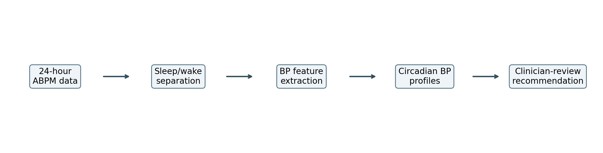
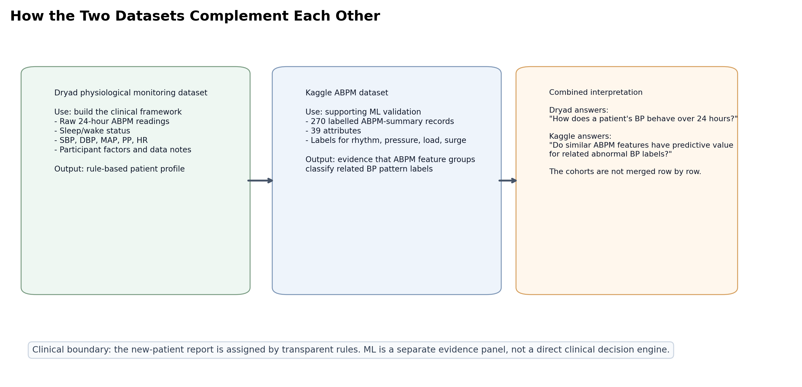
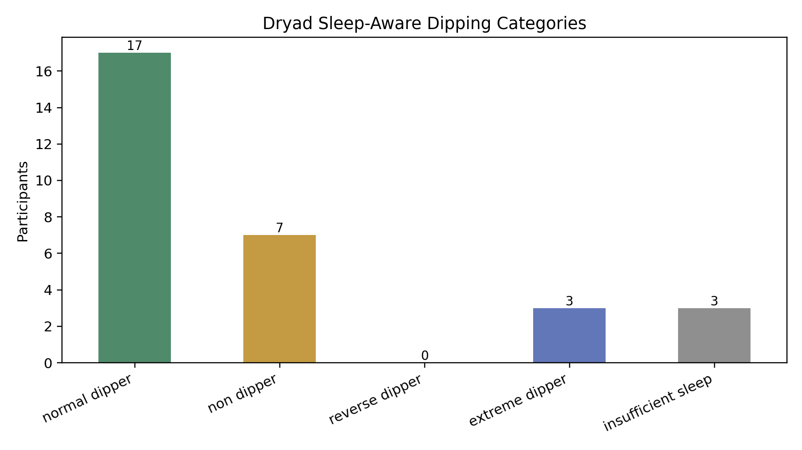
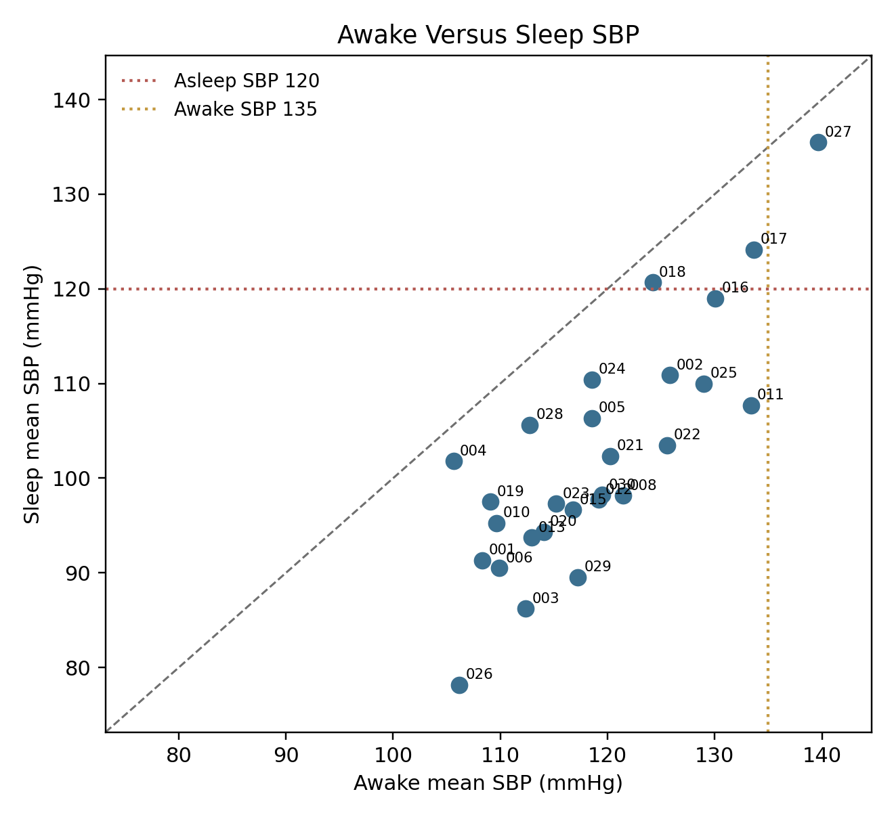
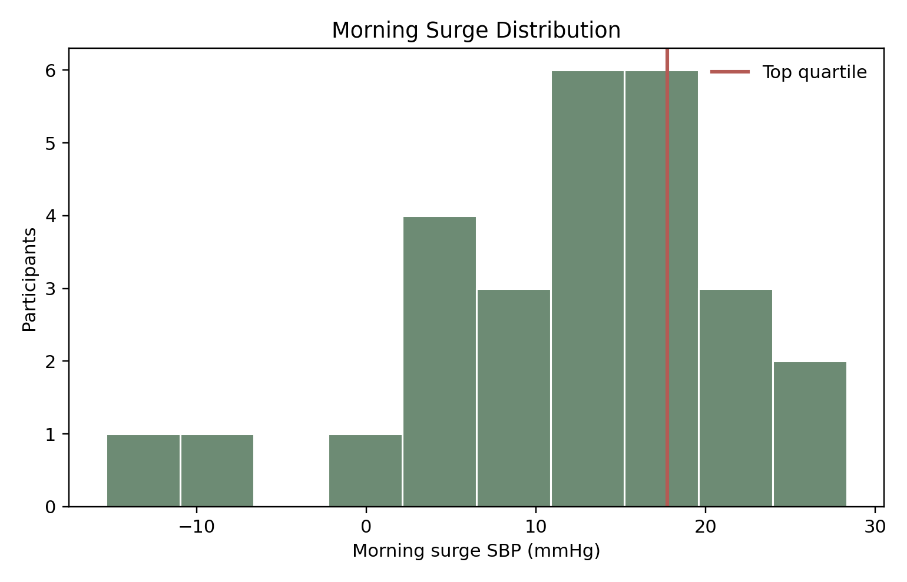
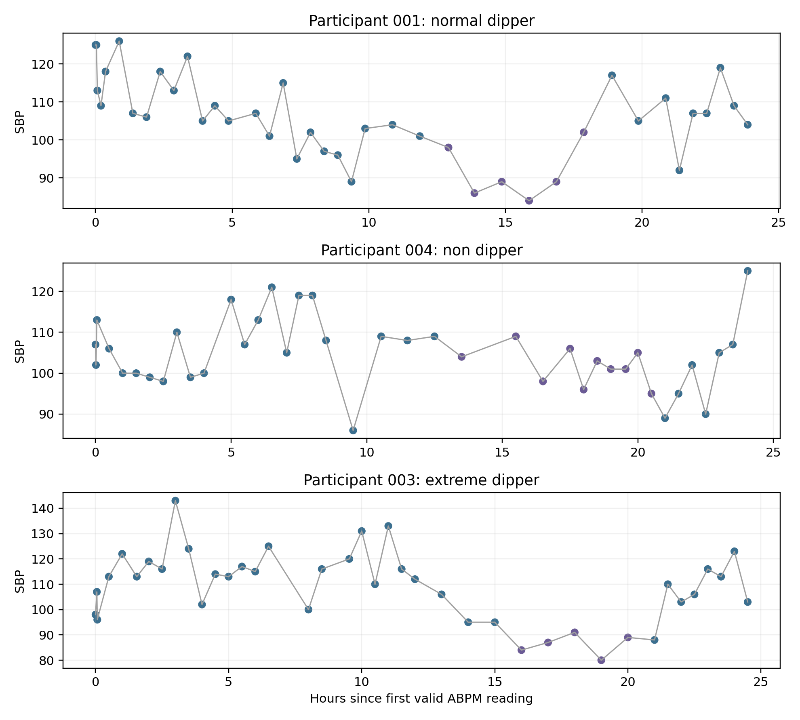
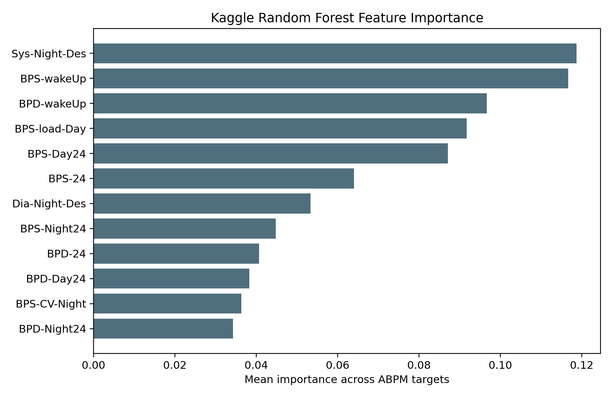
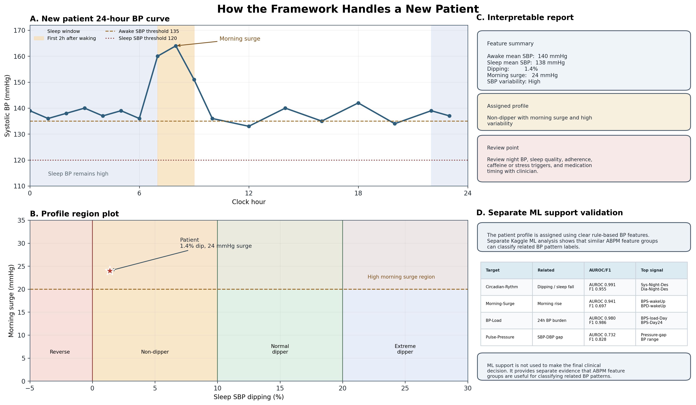

# A Sleep-Aware Blood Pressure Profiling Framework for Personalised Hypertension Monitoring

## Abstract

Hypertension control depends not only on the average blood pressure (BP), but also on how BP behaves during sleep, waking, and daily activity. This is clinically important in Sri Lanka, where hypertension is common, population ageing and cardiometabolic risk are increasing, and many patients remain undiagnosed, untreated, or uncontrolled. We developed an interpretable sleep-aware BP profiling framework using a 24-hour physiological monitoring dataset as the primary source and a Kaggle ambulatory blood pressure monitoring (ABPM) dataset as a separate machine-learning support dataset. Raw ABPM readings were cleaned, separated into awake and sleep periods, and converted into participant-level features including 24-hour BP, awake BP, sleep BP, dipping percentage, morning surge, variability, pulse pressure, mean arterial pressure, and heart-rate context. Profiles were assigned using transparent clinical rules. After filtering zero-value artefacts, 1,090 valid Dryad ABPM rows remained from 30 participants. Seventeen were normal dippers, seven non-dippers, three extreme dippers, and three had insufficient sleep BP data. Separate Kaggle models showed strong classification performance for BP load and circadian rhythm labels. The final framework generates a clinician-facing report and a Gemma-assisted explanation layer, while keeping treatment decisions rule-based and clinician-led.

## Keywords

Hypertension; ambulatory blood pressure monitoring; nocturnal hypertension; non-dipping; morning surge; blood pressure variability; Sri Lanka; clinician decision support; Gemma; interpretable machine learning.

## Introduction

Hypertension is a leading modifiable risk factor for cardiovascular disease, stroke, kidney disease, and premature mortality. In routine practice, however, BP is still often interpreted from clinic measurements or short home BP logs. These values are useful, but they can miss important temporal patterns. A patient may have acceptable clinic BP but elevated sleep BP, reduced nocturnal dipping, an exaggerated morning rise, or unstable BP across the day. Ambulatory blood pressure monitoring (ABPM) is valuable because it measures BP repeatedly during ordinary daily life and sleep, allowing clinicians to assess both BP burden and circadian behaviour.

This issue is especially relevant in Sri Lanka. The WHO Sri Lanka hypertension profile estimated 4.3 million adults aged 30-79 years living with hypertension in 2019. A nationally representative Sri Lankan analysis reported a weighted adult hypertension prevalence of 27.6%, with major losses across the diagnosis, treatment, and control cascade. Among adults with hypertension, only 44.2% were treated and 20.0% were controlled. These figures show a practical gap: Sri Lanka needs tools that help clinicians identify poorly controlled or unstable BP patterns in a way that is understandable, scalable, and safe.

The clinical literature supports this need. Contemporary European hypertension guidance recognises ABPM as useful for identifying white-coat and masked hypertension, assessing 24-hour BP burden, quantifying BP variability, measuring morning BP surge, and describing nocturnal dipping. Night-time BP and nocturnal hypertension are strongly linked to cardiovascular risk, and recent reviews continue to debate whether absolute nocturnal BP, non-dipping status, or both provide the most clinically useful risk information. Morning BP surge is also biologically plausible because cardiovascular events show morning clustering after waking, although thresholds and definitions vary between studies. These uncertainties argue for transparent reporting rather than automatic treatment decisions.

Despite the clinical value of ABPM, many ABPM reports remain difficult to translate into patient-specific monitoring advice. They may provide averages and raw tables without clearly answering what happened overnight, whether BP rose after waking, or what the doctor should review next. This is the main gap addressed by the present work. We developed a sleep-aware BP profiling framework that converts 24-hour ABPM data into clinically interpretable profiles and safe review points. The framework is designed for doctor-first use, with patient-understandable explanations. Machine learning is used only as a secondary support analysis on a separate labelled dataset, not as the primary decision method.



**Figure 1.** Overall sleep-aware BP profiling pipeline.

## Methods

### Study Design

This was a retrospective computational framework-development study. The work had three linked components. First, a primary sleep-aware ABPM feature-extraction pipeline was built using raw 24-hour physiological monitoring data. Second, the extracted features were converted into rule-based BP phenotypes and clinician-review outputs. Third, a separate labelled Kaggle ABPM dataset was used for machine-learning support validation. The Dryad and Kaggle datasets were deliberately not row-merged because they came from different cohorts and had different structures: Dryad provided raw time-series ABPM data with sleep/wake state, while Kaggle provided labelled ABPM summary features.

The primary clinical question was: can a 24-hour ABPM recording be converted into a simple, interpretable profile showing whether BP is abnormal during sleep, after waking, or across the full day? The secondary validation question was: do ABPM-derived feature groups have predictive value for related abnormal BP labels in an independent labelled dataset?

### Primary Dataset

The primary dataset was the 24-hour physiological monitoring dataset. Three files were used. `Blood_Pressure_Sleep_Info.xlsx` was the main ABPM file and contained participant ID, date, time, SBP, DBP, MAP, PP, HR, and sleep/wake state. `Participant_Information.csv` provided participant-level demographic and lifestyle context, including sex, age group, BMI, caffeine intake, and alcohol intake. `Data_Collection_Notes.csv` provided data-quality notes, including known device or collection issues.

Sleep/wake state was interpreted as:

```text
Wake_Sleep = 1  -> awake
Wake_Sleep = 0  -> asleep
```

All ABPM measurements were first ordered by participant and measurement datetime. Measurement datetime was generated by combining the date column and time column. Participant IDs were standardised as three-character strings, such as `001`, `002`, and `030`, to make merging across files reliable.

### ABPM Data Cleaning

The raw Dryad ABPM table contained 1,623 sleep-annotated rows. The pipeline removed rows with physiologically invalid zero values in SBP, DBP, MAP, or HR. A row was retained only if:

```text
SBP_i > 0
DBP_i > 0
MAP_i > 0
HR_i  > 0
```

Equivalently, the valid-row indicator was:

```text
Valid_i = 1 if (SBP_i > 0 and DBP_i > 0 and MAP_i > 0 and HR_i > 0)
Valid_i = 0 otherwise
```

Rows with `Valid_i = 0` were excluded from all feature calculations. This was necessary because zero BP or HR values are not clinically plausible and would bias the participant mean, dipping percentage, morning surge, and variability estimates. After filtering, 1,090 valid readings remained across 30 participants.

For each participant, the valid readings were sorted chronologically. The time from the first valid measurement was calculated as:

```text
HoursSinceStart_i = (MeasurementTime_i - FirstMeasurementTime) / 3600 seconds
```

This relative time variable was used for plotting 24-hour curves.

### Participant-Level Feature Extraction

For each participant `p`, the valid readings were separated into three sets:

```text
All_p   = all valid readings for participant p
Awake_p = valid readings where Wake_Sleep = 1
Sleep_p = valid readings where Wake_Sleep = 0
```

The number of valid readings was calculated as:

```text
N_all   = count(All_p)
N_awake = count(Awake_p)
N_sleep = count(Sleep_p)
```

Mean 24-hour BP was calculated as:

```text
Mean24hSBP = sum(SBP_i for i in All_p) / N_all
Mean24hDBP = sum(DBP_i for i in All_p) / N_all
```

Awake BP was calculated as:

```text
AwakeMeanSBP = sum(SBP_i for i in Awake_p) / N_awake
AwakeMeanDBP = sum(DBP_i for i in Awake_p) / N_awake
```

Sleep BP was calculated as:

```text
SleepMeanSBP = sum(SBP_i for i in Sleep_p) / N_sleep
SleepMeanDBP = sum(DBP_i for i in Sleep_p) / N_sleep
```

Pulse pressure was either read from the dataset or calculated as:

```text
PP_i = SBP_i - DBP_i
MeanPP = sum(PP_i for i in All_p) / N_all
```

Mean arterial pressure was either read from the dataset or calculated as:

```text
MAP_i = DBP_i + (SBP_i - DBP_i) / 3
MeanMAP = sum(MAP_i for i in All_p) / N_all
```

Mean heart rate was calculated as:

```text
MeanHR = sum(HR_i for i in All_p) / N_all
```

BP variability was represented using standard deviation and coefficient of variation. For SBP:

```text
SBP_SD = sqrt( sum((SBP_i - Mean24hSBP)^2) / (N_all - 1) )
SBP_CV_percent = (SBP_SD / Mean24hSBP) x 100
```

The same approach was used for DBP variability. HR-SBP correlation was calculated using Pearson correlation when both HR and SBP had more than one unique value:

```text
HR_SBP_corr = corr(HR_i, SBP_i)
```

This was included as exploratory physiological context rather than as a primary clinical endpoint.

### Dipping Percentage and Dipping Phenotype

The central sleep-aware feature was SBP dipping percentage. It was calculated as:

```text
Dipping_percent = ((AwakeMeanSBP - SleepMeanSBP) / AwakeMeanSBP) x 100
```

A participant was considered to have sufficient sleep BP data only when:

```text
N_sleep >= 3
```

If `N_sleep < 3`, the participant was labelled as `insufficient_sleep` and excluded from dipping and morning-surge interpretation. Otherwise, dipping phenotype was assigned as follows:

| Rule | Category |
|---|---|
| `Dipping_percent < 0` | Reverse dipper |
| `0 <= Dipping_percent < 10` | Non-dipper |
| `10 <= Dipping_percent <= 20` | Normal dipper |
| `Dipping_percent > 20` | Extreme dipper |
| `N_sleep < 3` | Insufficient sleep BP data |

This approach follows the common ABPM convention that a normal nocturnal SBP fall is approximately 10-20%.

### Morning Surge Calculation

Morning surge was calculated only when the participant had at least three valid sleep readings. The first wake time after a sleep period was identified from the sleep/wake sequence. The morning window was defined as the first two hours after this wake transition:

```text
MorningWindow = readings where:
  Wake_Sleep = 1
  WakeTime <= MeasurementTime_i < WakeTime + 2 hours
```

Morning surge was calculated as:

```text
MorningSurgeSBP = Mean(SBP_i in MorningWindow) - SleepMeanSBP
```

If no wake transition or no morning-window readings were available, morning surge was marked unavailable. In the Dryad analysis, high morning surge was defined relative to the cohort because the sample was small:

```text
HighMorningSurge = 1 if MorningSurgeSBP >= Q75(MorningSurgeSBP among available participants)
```

The resulting top-quartile threshold was 17.76 mmHg.

### Sustained High BP and ABPM Thresholds

Sustained high BP was defined using commonly used ABPM thresholds. A participant was flagged as having elevated 24-hour BP if:

```text
Mean24hSBP >= 130 or Mean24hDBP >= 80
```

Awake BP was flagged if:

```text
AwakeMeanSBP >= 135 or AwakeMeanDBP >= 85
```

Sleep BP was flagged if sufficient sleep readings were available and:

```text
SleepMeanSBP >= 120 or SleepMeanDBP >= 70
```

Sustained high BP required all three domains to be elevated:

```text
SustainedHighBP = Hypertensive24h and HypertensiveAwake and HypertensiveSleep
```

If sleep BP was insufficient, sustained high BP was marked unavailable rather than assumed normal.

### High Variability Definition

High variability was defined using the upper quartile of participant-level SBP standard deviation in the Dryad cohort:

```text
HighVariability = 1 if SBP_SD >= Q75(SBP_SD)
```

The resulting threshold was 13.96 mmHg. This was reported as a cohort-relative flag and not as a universal diagnostic cut-off.

### Integration of Participant Metadata and Data-Quality Notes

After feature extraction, participant-level features were merged with metadata by standardised participant ID. Sex, age group, BMI, caffeine intake, and alcohol intake were retained as contextual variables. Data collection notes were converted into a device-quality flag. A known issue was flagged when the issue field was not blank and was not coded as `N` or `No`:

```text
KnownDeviceIssue = 1 if IssueText not in {'', 'N', 'NO'}
```

A sensitivity dataset was also created by excluding participants with known device or collection issues. This was used to check whether the framework outputs could be regenerated in a cleaner subset, not to make a separate clinical claim.

### Rule-Based Profile Summary

The final participant profile combined dipping phenotype and additional review flags. The profile summary was constructed by appending present patterns:

```text
Profile = DippingCategory
if SustainedHighBP: add 'sustained high BP'
if HighMorningSurge: add 'morning surge'
if HighVariability: add 'high variability'
```

For example:

```text
Non-dipper with morning surge and high variability
```

Monitoring priority was assigned using conservative rules. Reverse dipping, sustained high BP, or the combination of high morning surge and high variability produced a high-priority review flag. Non-dipping, high morning surge, high variability, or elevated sleep BP produced a review-soon flag. Insufficient sleep data produced a data-review flag.

### Clinician-Review Recommendations

Each detected pattern was mapped to a safe review point. The wording was intentionally framed as review support rather than treatment advice:

| Detected pattern | Doctor review point |
|---|---|
| Insufficient sleep BP data | Review ABPM quality or consider repeat monitoring |
| Non-dipper | Review night BP and sleep quality |
| Reverse dipper | Prioritise nocturnal BP pattern review |
| Morning surge | Review morning BP control and medication timing with clinician |
| High variability | Check stress, caffeine, pain, missed medication, and measurement quality |
| Sustained high BP | Consider earlier treatment review |
| No major rule-based flag | Routine follow-up if clinically appropriate |

The system does not recommend starting, stopping, increasing, decreasing, or switching medication.

### Optional Physiological Data Coverage

The broader physiological dataset also included Zephyr, ECG-segment, and continuous glucose monitoring files. These were not used as primary outcomes. Instead, coverage was quantified to describe future extension potential. For each participant, the pipeline checked whether ABPM exports, CGM files, Zephyr summary files, ECG segment files, and BP-merged ECG segment files were present. This supported the statement that optional physiological context exists but is not yet sufficiently aligned to drive the main clinical claim.

### Kaggle ABPM Machine-Learning Validation

The Kaggle `.arff` file was parsed into a tabular dataframe. Attribute names were read from the ARFF header, and rows were read after the `@data` marker. All columns were converted to numeric values. The labels were:

```text
Validity
Circadian-Rythm
Pulse-Pressure
BP-Variability
BP-Load
Morning-Surge
```

Label distribution was calculated as:

```text
PositiveCount_label = sum(y_i = 1)
NegativeCount_label = N - PositiveCount_label
PositiveRate_label = PositiveCount_label / N
```

`BP-Variability` was excluded as a target because all 270 rows were positive, making supervised binary classification impossible. The modelled targets were:

```text
Circadian-Rythm
Pulse-Pressure
BP-Load
Morning-Surge
```

All non-label columns were used as input features. The two baseline models were logistic regression and random forest. Logistic regression used standard scaling and class weighting:

```text
z_ij = (x_ij - mean_j) / SD_j
logit(P(y_i = 1)) = beta_0 + beta_1 z_i1 + ... + beta_p z_ip
```

Random forest used 300 trees, minimum leaf size of 2, class balancing, and a fixed random seed. Five-fold stratified cross-validation was used so each fold preserved the target-label distribution as closely as possible:

```text
For fold k in 1..5:
  train model on 4 folds
  predict labels and probabilities on held-out fold
Combine held-out predictions across all folds
```

The following metrics were calculated from cross-validated predictions:

```text
Accuracy = (TP + TN) / (TP + TN + FP + FN)
Sensitivity = TP / (TP + FN)
Specificity = TN / (TN + FP)
Precision = TP / (TP + FP)
F1 = 2 x (Precision x Sensitivity) / (Precision + Sensitivity)
BalancedAccuracy = (Sensitivity + Specificity) / 2
```

AUROC was calculated from the cross-validated predicted probabilities. Confusion matrices were saved for every target-model pair. Feature importance was estimated using the absolute logistic-regression coefficient for logistic regression and Gini-based feature importance for random forest. The top 15 features per model-target pair were saved.

### New-Patient Workflow

For a new patient, the framework expects an ABPM file with at least time, SBP, and DBP. HR, MAP, PP, and sleep/wake labels are used when available. If sleep/wake labels are absent, the prototype can derive sleep state from entered usual sleep and wake times. The analysis then follows the same sequence:

```text
Upload ABPM file
  -> clean invalid readings
  -> assign or read sleep/wake state
  -> calculate sleep-aware features
  -> assign rule-based profile
  -> generate graphs and report table
  -> provide clinician-review points
```

The dashboard shows the 24-hour BP curve, awake-versus-sleep BP comparison, dipping-versus-morning-surge profile plot, pattern-status table, data-quality indicators, and patient-friendly explanation.

### Gemma-Assisted Report Explanation

The project includes an `Ask About This BP Report` assistant using Hugging Face-hosted Gemma 4. The assistant is not given raw ABPM rows. Instead, it receives a compact report summary:

```text
profile
priority
mean 24-hour BP
awake BP
sleep BP
dipping percentage
morning surge
BP variability flag
sustained high BP flag
data quality
review points
```

The prompt instructs the model to explain only the provided report summary, avoid diagnosis, avoid prescribing, avoid medication-change advice, and recommend urgent medical care if urgent symptoms are mentioned. Medication-change questions are additionally intercepted by a rule-based guardrail before calling the model. This design keeps the clinical decision rule-based while allowing doctors, nurses, or patients to ask simple explanatory questions about the already generated report.



**Figure 2.** Complementary roles of the Dryad and Kaggle datasets.

## Results

The primary Dryad ABPM file contained 1,623 raw sleep-annotated BP rows. After removing invalid zero-value readings, 1,090 valid rows remained across 30 participants. Participants `007`, `009`, and `014` had insufficient valid sleep BP data for dipping and morning-surge analysis. The data notes identified known device or collection issues in eight participants (`006`, `007`, `009`, `014`, `019`, `020`, `022`, and `027`), and these were retained as flags for sensitivity interpretation.

Among the 30 participants, 17 were classified as normal dippers, seven as non-dippers, three as extreme dippers, and three as insufficient sleep BP data. No reverse dipper was observed in this cohort after filtering. Eight participants were flagged for high SBP variability, seven for high morning surge, and one for sustained high BP. The high-variability threshold was an SBP standard deviation of 13.96 mmHg, corresponding to the cohort top quartile. The high morning-surge threshold was 17.76 mmHg, also defined as the top quartile of available values.



**Figure 3.** Rule-based dipping categories in the primary ABPM dataset.

The awake-versus-sleep SBP plot showed how participant profiles differ beyond a single 24-hour average. Some participants had clear sleep-related BP reduction, while others had sleep SBP close to awake SBP, consistent with non-dipping behaviour. Threshold lines for awake and sleep SBP provided a clinically intuitive view of BP load.



**Figure 4.** Awake and sleep SBP relationship across participants.

Morning surge varied substantially across participants with adequate sleep data. Because this was a small development dataset, the top-quartile approach was used to flag relatively high surge rather than claiming a universal diagnostic threshold.



**Figure 5.** Distribution of morning surge in the primary dataset.

Example 24-hour BP curves demonstrated the clinical purpose of the framework. A raw ABPM curve can show whether BP remains high during sleep, rises after waking, or fluctuates widely across the day. These visual patterns are easier for clinicians and patients to understand than a table of isolated measurements.



**Figure 6.** Example sleep-aware BP curves.

Optional physiological streams were available but were not treated as primary outcomes. ABPM exports and Zephyr summaries were present for 30 participants, CGM files for 23 participants, ECG segment files for 29 participants, and BP-merged ECG segment files for 18 participants. These streams support future physiological extensions but were not used to make the main BP claims.

In the Kaggle dataset, label distributions were imbalanced. Morning-Surge was positive in 37 of 270 rows (13.7%), while BP-Variability was positive in all rows and was not modelled as a target. Best cross-validated model performance was strongest for BP load and circadian rhythm. Random forest classified BP-Load with AUROC 0.980, F1-score 0.986, and balanced accuracy 0.976. Random forest classified Circadian-Rythm with AUROC 0.991, F1-score 0.955, and balanced accuracy 0.935. Logistic regression performed best for Morning-Surge with AUROC 0.941, F1-score 0.697, and balanced accuracy 0.874. Logistic regression performed best for Pulse-Pressure with AUROC 0.732, F1-score 0.828, and balanced accuracy 0.737.

| Target | Best model | AUROC | F1 | Balanced accuracy |
|---|---|---:|---:|---:|
| BP-Load | Random forest | 0.980 | 0.986 | 0.976 |
| Circadian-Rythm | Random forest | 0.991 | 0.955 | 0.935 |
| Morning-Surge | Logistic regression | 0.941 | 0.697 | 0.874 |
| Pulse-Pressure | Logistic regression | 0.732 | 0.828 | 0.737 |



**Figure 7.** Kaggle feature importance supports the relevance of ABPM-derived feature groups.

For a new patient, the framework produces a rule-based report rather than a model-generated clinical decision. For example, a patient with awake mean SBP 140 mmHg, sleep mean SBP 138 mmHg, dipping percentage 1.4%, morning surge 24 mmHg, and high SBP variability would be reported as "non-dipper with morning surge and high variability." The review point would be to assess night BP, sleep quality, adherence, caffeine or stress triggers, and medication timing with a clinician.



**Figure 8.** New-patient rule-based reporting with separate ML support validation.

## Discussion

This study developed and implemented a sleep-aware ABPM profiling framework that converts raw 24-hour BP readings into clinically interpretable patterns. The main contribution is the combination of transparent rule-based patient profiling, visual report generation, and separate machine-learning support validation. The framework does not attempt to replace clinical judgement. Instead, it organises ABPM information into a format that helps clinicians review the timing and pattern of BP control.

The results align with the broader ABPM literature. Existing guidelines and reviews emphasise that out-of-office BP, particularly night-time BP, adds information beyond clinic BP. Nocturnal hypertension and non-dipping are associated with increased cardiovascular risk, although debate remains about which metric is most prognostically robust. This uncertainty supports our decision to report both sleep BP burden and dipping percentage rather than using dipping alone. Similarly, the morning surge literature recognises potential clinical relevance but also highlights variation in definitions and thresholds. Our framework therefore reports morning surge as a review signal, not as a stand-alone treatment trigger.

The Sri Lankan relevance is practical. A large proportion of adults with hypertension are not adequately controlled, and health services need tools that can improve interpretation without creating unsafe automation. Sri Lanka has specialist clinics where ABPM may be used for selected patients, but it is unlikely to be available for every patient in primary care. A reasonable first use case is therefore targeted: patients with suspected nocturnal hypertension, poor clinic control, morning BP problems, high variability, resistant hypertension, suspected masked hypertension, or medication-timing questions. In these settings, a structured ABPM report can help a clinician decide what to review next.

The Kaggle analysis strengthens the framework but should be interpreted carefully. The high performance for BP-Load and Circadian-Rythm suggests that ABPM-derived summary features contain useful information for classifying abnormal BP patterns. The Morning-Surge result is also encouraging despite label imbalance. However, this is not direct validation of the Dryad participants or a new Sri Lankan patient. It is better understood as dataset-level support: similar ABPM feature groups are meaningful in a separate labelled dataset.

The Gemma integration addresses a different but important problem: interpretability at the point of use. A monitoring system can fail clinically if its output is technically correct but difficult to explain. The assistant allows a doctor or patient to ask questions such as "Why is this patient flagged?", "What does non-dipper mean?", or "What should be reviewed next?" Because the assistant receives only the calculated report summary, it supports explanation rather than independent medical analysis. This design reduces unnecessary data sharing and keeps clinical responsibility with the treating clinician. In future deployments, privacy, local governance, audit logging, and institutional approval would still be required before use with identifiable patient data.

The study has limitations. The primary dataset included only 30 participants, so cohort-relative thresholds for variability and morning surge should not be treated as universal cut-offs. Several participants had insufficient valid sleep BP readings, reinforcing the importance of data-quality reporting. The Dryad and Kaggle datasets came from different cohorts and cannot be row-merged. The machine-learning component validates feature relevance but not patient-level outcomes. The framework has not yet been prospectively validated in Sri Lankan clinical practice, and it does not test whether reporting these profiles improves BP control, medication adherence, cardiovascular outcomes, or hospital admissions.

Future work should include clinician review of the report wording, usability testing with Sri Lankan doctors and nurses, and prospective evaluation in selected hypertension clinics. Expert review should ideally involve a consultant cardiologist, consultant physician, nephrologist, clinical pharmacologist, and ABPM nurse or technician. Once reviewed, the manuscript can state that the clinical wording and monitoring pathway were independently assessed for safety and interpretability. Until then, the appropriate claim is that expert clinical validation is planned.

## Conclusion

The sleep-aware BP profiling framework converts 24-hour ABPM readings into interpretable circadian BP profiles using transparent clinical rules. In the primary dataset, it identified normal dipping, non-dipping, extreme dipping, high morning surge, high variability, insufficient sleep BP data, and sustained high BP patterns. A separate Kaggle analysis showed that related ABPM feature groups can classify abnormal BP pattern labels, supporting the relevance of the framework without replacing rule-based clinical interpretation. The addition of a Gemma-assisted explanation layer may improve doctor and patient understanding while preserving the safety boundary that medication decisions remain clinician-led. With expert review and prospective validation, this framework could support more personalised hypertension monitoring in Sri Lanka and similar health-system settings.

## Data and Code Availability

The analysis code, dashboard prototype, report assistant, paper figures, tables, and manuscript files are available at:

```text
https://github.com/maninka123/personalised-bp-monitoring
```

Raw datasets are not committed to the repository. The analysis expects the Dryad physiological monitoring dataset and Kaggle ABPM `.arff` file to be stored locally.

## Ethics and Clinical Use Statement

This is a retrospective data-analysis and software-prototype project using public or locally stored research datasets. It is not a medical device and is not approved for independent clinical decision-making. Any clinical use would require local governance review, privacy assessment, expert validation, prospective testing, and appropriate clinical oversight.

## References

1. World Health Organization. Sri Lanka Hypertension Profile 2023. https://cdn.who.int/media/docs/default-source/country-profiles/hypertension/hypertension-2023/hypertension_lka_2023.pdf
2. Rannan-Eliya RP, et al. Hypertension diagnosis, awareness, treatment, and control in Sri Lankan adults: a nationally representative cross-sectional study. BMC Public Health. https://link.springer.com/article/10.1186/s12889-025-22659-7
3. European Society of Hypertension. 2023 ESH Guidelines for the management of arterial hypertension. Journal of Hypertension. https://ehrica.org/wp-content/uploads/2024/12/guias-esc-2023-hta.pdf
4. American College of Cardiology/American Heart Association. 2017 Guideline for High Blood Pressure in Adults. https://www.acc.org/About-ACC/Press-Releases/2017/11/13/15/35/High-blood-pressure-redefined-for-first-time-in-14-years-130-is-the-new-high
5. Salles GF, et al. Non-dipping blood pressure or nocturnal hypertension: does one matter more? Current Hypertension Reports. https://pubmed.ncbi.nlm.nih.gov/37955827/
6. Sheppard JP, et al. Prognostic significance of the morning blood pressure surge in clinical practice: a systematic review. American Journal of Hypertension. https://pmc.ncbi.nlm.nih.gov/articles/PMC4261916/
7. Project data files analysed by this repository: `Blood_Pressure_Sleep_Info.xlsx`, `Participant_Information.csv`, `Data_Collection_Notes.csv`, and `ABPM-dataset.arff`.
